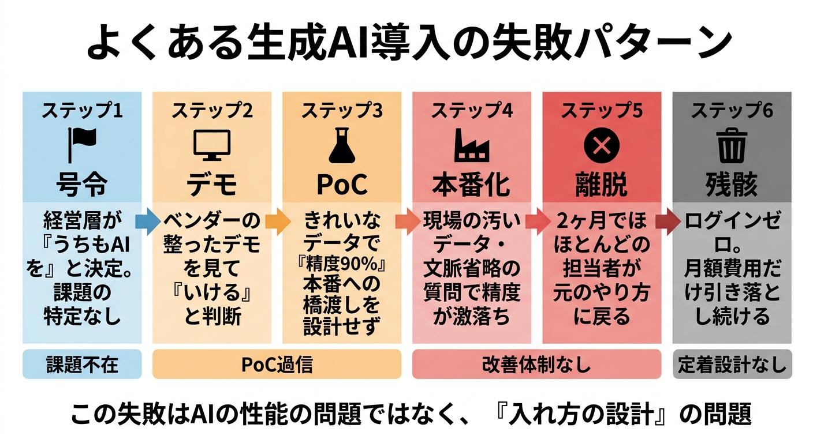
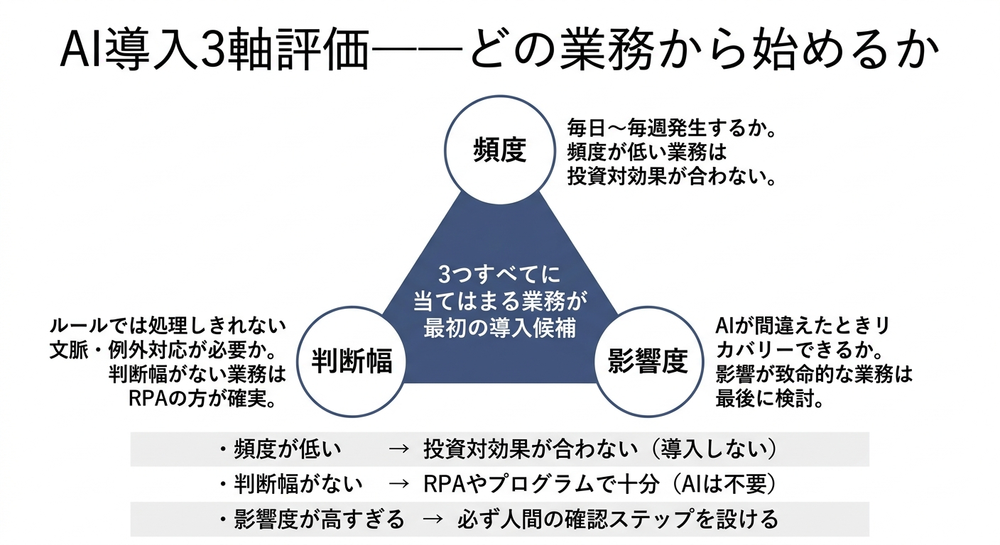
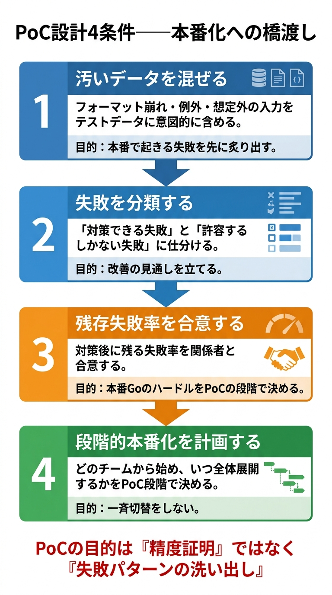
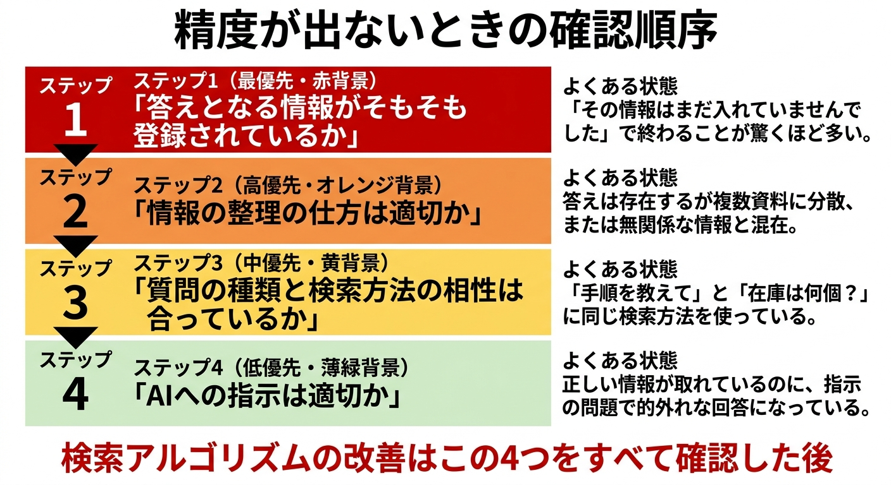
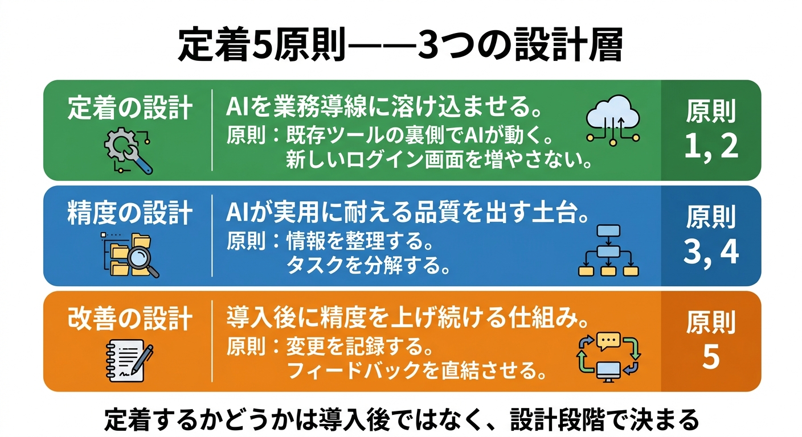
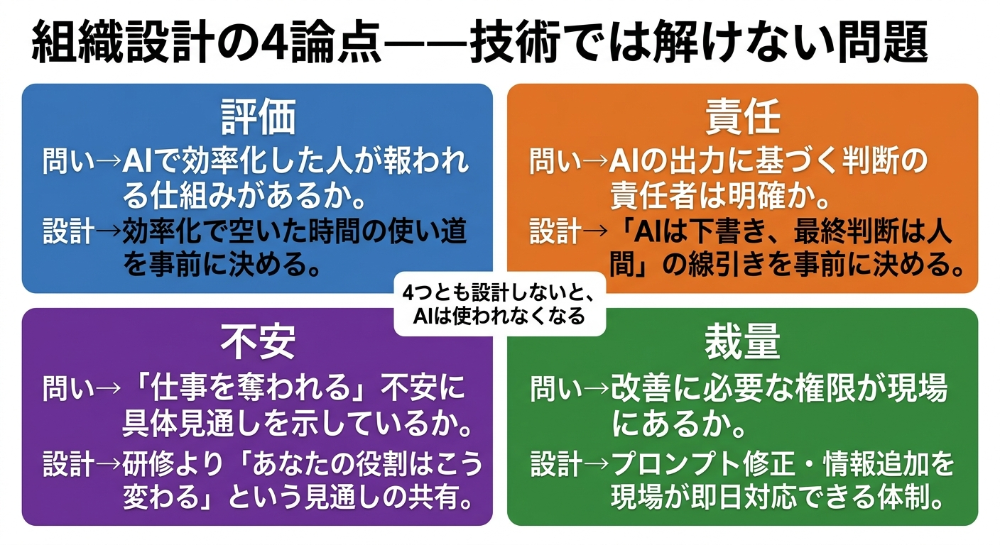
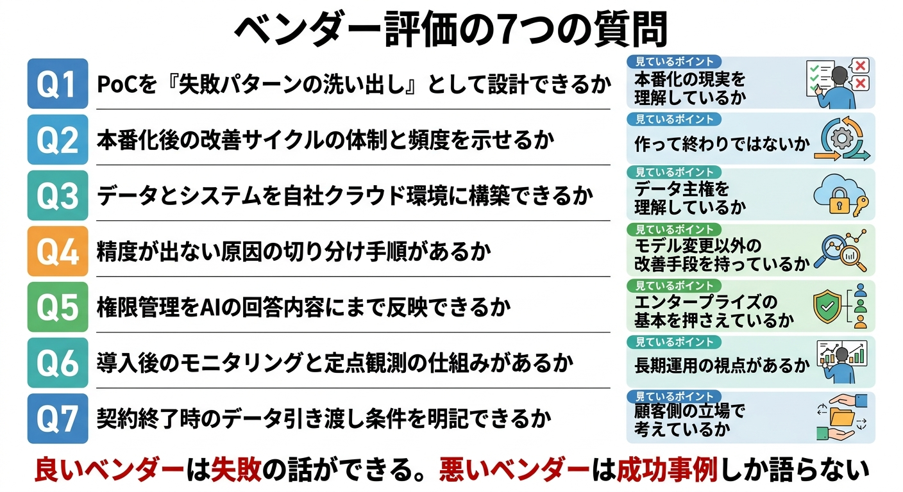

[← トップに戻る](/) | [読者特典シート →](sheets/)

---

# 生成AIは現場から入れろ

## 机上のDXで終わらせない、現場に定着する導入の考え方

**黛 政隆 著**

---

# はじめに

AI導入支援の仕事をしていると、相談の入口でよく聞かされる話があります。

- 去年AIを入れたが、気づけば誰もログインしていない
- 報告書には「導入済み」と書かれているのに、業務のやり方は何一つ変わっていない
- 使っているのは一部の意識の高い社員だけで、大多数は触ってもいない
- デモのときは盛り上がったのに、数カ月後にはその熱気がどこにもない

特別な話ではありません。むしろ、私のところに相談が来るときの**典型的なパターン**です。

業種も会社規模も違うのに、話を聞くと驚くほど同じ展開になっています。導入は終わっている。請求書は届いている。でも現場の景色は、導入前と何も変わっていない。

正直なところ、こういう話を聞くたびに、もったいないと思います。

技術は悪くない。予算もかけている。担当者も真面目にやっている。なのに、誰も幸せになっていない。

---

なぜこうなるのか。AIの性能が足りないのか。現場のITリテラシーが低いのか。

多くの場合、どちらでもありません。**入れ方が間違っているんです。**

「AIを導入すること」が目的になっていて、「AIが現場で使われること」に目が向いていない。**導入と定着の間にある溝** を、誰も設計していない。

これは技術の問題ではなく、仕組みの問題です。私はそう確信しています。なぜなら、仕組みを変えた途端に結果が変わるケースを、何度も見てきたからです。

---

本書のタイトルは「生成AIは現場から入れろ」です。なぜ現場からなのか。

理由は構造的なものです。

- 現場に近いほど、解くべき課題が具体的になる
- 具体的な課題があれば、成功の定義が明確になる
- 頻度の高い業務に入れれば、改善サイクルが速く回る
- 普段使っているツールの中にAIを組み込めば、「わざわざ使う」という摩擦がなくなる
- 小さく始められるからリスクも小さい

逆に、経営層の号令で全社一斉に導入しようとすると、課題が曖昧なまま大きなプロジェクトが走り出します。PoC（ピーオーシー。Proof of Conceptの略。本格導入の前に小さく試して、効果や実現性を確かめる工程のこと）で良い数字を出して満足し、本番では使われない。

根性や気合いの問題ではありません。構造の問題です。だから、構造を変えれば結果は変わります。

---

本書は生成AIの技術入門ではありません。本書が扱うのは、**「生成AIを現場に入れて、定着させるにはどう考えればいいか」** という、導入設計と運用の話です。

具体的には、以下のことを書きました。

- なぜ生成AI導入は失敗するのか、その構造を分解した
- なぜ現場から入れるべきなのか、そのロジックを示した
- AIを入れるべき業務と入れない方がいい業務の判断基準を整理した
- PoCが止まる理由と、本番化への橋の架け方を書いた
- 現場に定着するための技術的な設計の考え方を示した
- 技術より難しい、人と組織の問題に踏み込んだ
- 精度改善、コスト設計、品質管理など、実務的な進め方を書いた
- AIとこれからどう向き合うべきかを考えた

すべてに共通するのは、私自身の判断基準です。何を優先し、何を捨てるか。どこにこだわり、どこを割り切るか。技術の話をしているようで、本質はそこにあります。

---

この本を読んでほしいのは、こんな方です。

- 生成AIに興味はあるが、何から始めていいかわからない
- AIを導入してみたが、現場に定着していない
- PoCは成功したのに、本番化できずにいる
- ベンダーの提案を聞いても、どう判断すればいいかわからない
- 抽象的なAI論ではなく、現場で使える考え方を知りたい

経営者でも、現場マネージャーでも、情シスの担当者でも、役職は問いません。共通しているのは、**「AIを本気で現場に根付かせたい」** という意思です。

---

少しだけ、自己紹介をさせてください。

私は黛 政隆（まゆずみ まさたか）と申します。株式会社GembaShiftの代表です。

社名の「GembaShift」は、そのまま「現場を変える」という意味で付けました。生成AIの導入支援を仕事にしていますが、やっていることの本質はAIの実装ではありません。

現場の業務を理解し、AIが定着する仕組みを設計し、運用に乗せるところまでを一貫して見る。PoCで終わらせない。納品して終わりにしない。現場で使われ続ける状態を作ることが、自分の仕事だと思っています。

もともとはエンジニア兼プロジェクトマネージャーとして、業務システムの設計・開発に携わってきました。技術の中にいた時間が長い。だからこそ、技術だけでは現場は変わらないということを身をもって知っています。

どれだけ優れた仕組みを作っても、現場の人が使わなければ意味がない。その当たり前に気づくまでに、自分もずいぶん時間がかかりました。

この本に書いたことは、理論ではありません。自分が現場で判断し、失敗し、修正し、定着させてきた経験から体系化したものです。学術論文のような網羅性はありません。代わりに、実際の導入で使える判断基準があります。

---

一つだけ、先にお断りしておきます。

この本には「AIですべてが解決する」とは書いていません。導入に銀の弾丸はありません。

しかし、正しい場所に正しい形で入れれば、確実に現場を楽にする力を持っています。その「正しい場所」と「正しい形」を見極めるための考え方を、この本でお伝えしたいと思っています。

私は、技術を「人の自由を増やし、価値を増幅する道具」だと考えています。

面倒な作業をAIに任せて、人は問いを立て、判断し、共感し、新しい価値を生み出すことに集中する。そういう現場を、一つでも多く作りたい。

技術が人を管理するためではなく、人を自由にするために使われる。そんな当たり前のことが、まだまだ当たり前になっていません。だから、この本を書きました。

---

# 第1章　生成AI導入がうまくいかない本当の理由

## ある食品卸会社で起きたこと

※本書に出てくる企業事例は、守秘義務の関係から、複数の実際の相談・支援案件をもとに業種・規模・状況を組み合わせて再構成しています。特定の一社を指すものではありませんが、描いている構造と失敗の中身は、私が現場で何度も目にしてきた実在のパターンです。

まず紹介するのは、食品卸A社の事例です。

この会社のことは、導入が終わった後に「思ったように動いていない」という相談をいただいたことで知りました。私自身は最初のベンダー選定やPoCには関わっておらず、半年ほど経ってから別の知り合い経由で話が回ってきた形です。つまり私は、**うまくいかなかった現場に、後から入って中を見せてもらった**立場です。

食品卸A社は、従業員150名ほどの中堅企業です。問い合わせ対応に課題を抱えていました。

得意先から「この商品の賞味期限の基準は？」「あの件の納品スケジュールは？」と電話が入るたびに、担当者は社内のマニュアルや過去の対応履歴を探します。分厚いファイル、共有フォルダの奥にあるExcel、ベテラン社員の記憶。あちこちに散らばった情報をかき集めて回答するのに、1件あたり10分はかかっていました。

月末には問い合わせが集中し、対応に追われて集計業務が後ろ倒しになる。残業が常態化していました。

ある日、社長が経営セミナーに参加しました。講師が「AIで問い合わせ対応を自動化し、業務時間を半減させた事例」を紹介していた。社長は帰社後すぐに情シス担当を呼びました。「うちもAIを入れよう」と。

ベンダーに相談し、AI搭載の問い合わせ対応システムの導入が決まりました。社内のマニュアルや商品情報をAIに読み込ませ、よくある質問に自動で回答できるようにする。PoCでは、整理された商品データと想定質問を使ってテストが行われました。「精度85%」という数字が出た。社長は満足し、本格導入にゴーサインを出しました。

しかし、本番環境で使い始めると様子が変わりました。

現場から来る質問は、PoCで使ったきれいな質問文とはまるで違ったんです。「あれ、先週言ってたやつどうなった？」「いつもの、あの件」。文脈も主語も省略された、日常会話そのままの問い合わせ。AIは的外れな回答を返しました。商品名の略称や社内独自の呼び方にも対応できませんでした。

現場の担当者は、最初の数日は試しに使ってみました。しかし、間違った回答を得意先に伝えるわけにはいきません。結局、自分でマニュアルを探す方が早いし確実だと判断した。「使いにくい」「前のやり方の方が速い」。そんな声が広がり、2カ月もしないうちに、ほとんどの担当者が元のやり方に戻りました。

半年後、そのAIシステムにログインしている人はゼロでした。月額の利用料だけが静かに引き落とされ続けていたんです。

---

このA社の話を「AIの性能が足りなかった」で片づけることもできます。しかし、それは正確ではありません。

問題は、AIの性能ではなく、入れ方にありました。もっと言えば、**「導入すること」と「定着すること」の間にある溝を、誰も設計していなかった。** ここが大事なポイントです。

このA社がその後どう立て直したかは、後の章で書きます。ここではまず、A社の失敗に限らず、生成AI導入がうまくいかない理由の構造を整理したいと思います。

なぜなら、**この失敗の構造は、業種も規模も違う企業で驚くほど共通しているからです。**

私がこのテーマに本気で向き合っているのは、同じ構造の失敗が繰り返されているのを見てきたからです。そして、その構造は変えられると知っているからです。

## 失敗の構造はどこも似ている

生成AI導入の失敗には、驚くほど共通したパターンがあります。業種も規模も違う企業で、なぜか同じ話を聞く。

最初のうちは偶然かと思っていました。しかし、何社も見ていくうちに確信に変わりました。**同じ構造の中でプロジェクトが動いているから、同じ結果になるんです。**

最初のきっかけは、たいてい経営層の「うちもAIを」という号令です。ニュースで他社の取り組みが紹介される。業界の集まりで「うちはもうAIを導入した」という話が出る。取引先から「御社はAI活用されていますか」と聞かれる。

こうした外からの刺激で、「うちも何かやらないと」という空気が生まれます。

ここまでは、別に悪いことではありません。きっかけは何であれ、動き出すこと自体には意味がありますから。

問題は、その後の進め方です。

号令が出ると、情シスやDX推進部（DXはデジタルトランスフォーメーションの略。デジタル技術で業務や組織のやり方そのものを変えていく取り組みのこと）に「何か考えてくれ」とボールが落ちます。

担当者はベンダーに声をかけ、デモを見せてもらう。デモは当然、見栄えのいいものが用意されています。「御社の業務に合わせてカスタマイズできます」という説明付きで、うまく動いている画面を見せられます。

心当たりはありませんか。

経営層にデモを報告すると、「いいじゃないか、進めてくれ」となる。PoCが始まる。限られたデータ、限られたユースケースでテストが行われ、「精度90%」のような数字が出る。「これならいける」と判断され、本格導入が決まります。

ここまでは、教科書通りの手順を踏んでいるように見えます。しかし、この先で多くのプロジェクトが止まるんです。

本番環境に入れた途端、次々と問題が出てきます。

- 精度が落ちる
- PoCでは使わなかった種類のデータが来る
- 想定していなかった質問が飛んでくる
- 現場からは「使いにくい」「前のやり方の方が早い」という声が出る
- 改善しようにも、誰がどう直すのかが決まっていない
- 導入を推進した担当者は次のプロジェクトに移っている
- ベンダーとの契約は納品で終わっている

結果、「AIは使えない」という結論だけが残ります。

A社で起きたことは、まさにこの流れそのものでした。**この流れは、AIの性能の問題ではありません。入れ方の設計の問題です。** もっと言えば、「導入すること」と「定着すること」の間にある溝を、誰も設計していなかったということです。

この構造を見るたびに思います。これは本当にもったいない。技術も予算も意欲もあるのに、入れ方の設計一つで全部が無駄になってしまう。

## 「他社もやっている」から始まる導入は危うい

生成AI導入のきっかけとして、「他社もやっているから」は最も多い理由の一つでしょう。同業他社がプレスリリースを出していた、展示会でAI活用事例を見た、経営セミナーで講師が「AIを使わない企業は取り残される」と言っていた。

こうした外圧をきっかけにすること自体は否定しません。

ただし、**「他社がやっている」という事実からわかるのは、「他社がやっている」ということだけです。** その他社が本当に成果を出しているのか、現場で実際に使われているのかは、プレスリリースには書かれていません。表に出てくるのは華やかな発表だけで、その裏で何が起きているかは誰にもわからないんです。

正直なところ、私自身もこういう場面に出くわしたことがあります。「他社さんの成功事例を聞いて導入を決めました」と言われて現場に入ったら、参考にしたはずの他社でもほとんど使われていなかった。プレスリリースの華やかさと現場の実態には、かなりの温度差があるのが実情です。

「他社もやっている」を根拠にした意思決定には、もう一つ構造的な問題があります。**自社の課題から出発していない、ということです。**

自社の現場で何が困っていて、何が解決されれば価値が出るのか。その問いを飛ばして「とりあえずAIを入れる」と決めた時点で、プロジェクトは着地点を見失っています。着地点がなければ成功基準も曖昧になり、曖昧な基準で「うまくいった」と判断するから、本番で崩れる。

こう書くと当たり前のことに見えるかもしれません。

しかし実際のプロジェクトでは、驚くほどこの当たり前が抜け落ちています。「AIを導入する」というプロジェクト自体が社内で大きな動きになり、関係者が増え、スケジュールが引かれ、予算が確保された時点で、「そもそもなぜやるのか」を立ち止まって問い直すことが難しくなります。

動き出した電車を止めるのは、走らせ続けるよりはるかに難しい。

**これは担当者の能力の問題ではありません。「きっかけ」と「目的」を混同しやすい構造の問題です。** だからこそ、個人を責めても何も解決しません。仕組みの側を変える必要があります。

## PoCが成功しても、安心してはいけない

PoCで良い数字が出ると、プロジェクト全体に安堵感が広がります。「やれる」という空気が流れ、本格導入への舵が切られます。

しかし、**PoCの成功は、本番でうまくいくことの証明にはなりません。**

少し考えてみてください。

PoCの環境は、こんな状態です。

- 整った状態のデータを使う
- 想定通りの質問を投げる
- 限られた人数で、限られた条件でテストする

テスト環境というのは、うまくいくように設計された環境です。そこで精度が出るのは、ある意味当然のことでしかありません。

一方、本番で起きることはまったく違います。

- フォーマットがばらばらの書類
- 記入漏れのある帳票
- 略語だらけの報告書
- 「こう聞けば正しく答える」と設計したやり方ではなく、自分の言葉・自分のやり方で聞いてくる人たち

A社で起きたように、「あれ、先週のやつどうなった？」という聞き方が現場の日常です。PoCで見えていた景色と、本番で見える景色は別物なんです。

そして多くのプロジェクトでは、**PoCの目的が「経営層への報告」になっています。** 報告に必要なのは良い数字です。良い数字を出すために、きれいな条件でテストする。その結果、PoCは「成功体験を作るためのイベント」になり、本番への橋渡しとしての役割を果たしません。

私自身、PoCの報告書に並んだ数字だけを見て「これはいける」と思い、本番に進めた結果、現場でまったく使われなかったという経験があります。あの時に学んだのは、数字の裏にある条件をもっと疑うべきだったということでした。

これも担当者が手を抜いているわけではありません。「PoCで良い数字を出す」ことがプロジェクトの中間目標として設定されている以上、担当者はその目標に向かって動くしかない。仕組みがそうなっているんです。

PoCをどう設計すれば本番に繋がるのかについては、第4章で詳しく述べます。ここで押さえておきたいのは、**PoCの成功で安心してしまう構造そのものが、失敗の入り口になっている** という事実です。

## 「導入すること」が目的になっている

ここまでの話に共通しているのは、**「AIを導入すること」自体がいつの間にか目的になっている** という構造です。

本来、AIは手段でしかありません。何かの業務課題を解決するための道具です。

しかし、「AIを入れる」と決まった瞬間、プロジェクトのゴールが「AIを入れること」にすり替わります。

- 予算はAI導入のためにつく
- KPI（目標の進捗を測る指標のこと）はAI導入の進捗で設定される
- 報告は「導入しました」で完了する

この目的のすり替わりは、意識的に起きるものではありません。誰も「手段を目的にしよう」とは思っていません。

しかし、プロジェクトが組織の中で動き始めると、目に見える成果を出す必要が生まれます。「導入した」は目に見える成果です。「現場で使われている」は、測定しにくく、時間もかかる。

**評価の仕組みが「導入したかどうか」に寄っている限り、このすり替わりは自然に起きます。**

正直に言って、この構造は歯がゆいです。現場のために技術を入れているはずなのに、評価の仕組みが「導入したかどうか」に偏っているせいで、現場が置き去りにされる。誰も悪意はないのに、仕組みのせいで正直にやっている人が報われない。

こういう構造を見るたびに、変えなければいけないと強く思います。

結果として、現場に定着しないシステムが量産されます。それを見た現場は「AIなんて使えない」と思い、次の導入にも消極的になる。導入側は「現場が使ってくれない」と嘆く。どちらも悪意はありません。ただ、目的の設定がずれていただけです。

### 問い方を変えるだけで、景色が変わる

この溝を埋めるには、導入プロジェクトの最初の段階で問い方を変える必要があります。

「AIを使って何を解決するのか」という問いに、具体的に答えられるかどうかです。

「業務効率化」のような抽象的な答えではなく、**「この業務のこの工程で、こういう課題があるから、AIでこう変えたい」と言えるかどうか。** これが言えない状態で導入を始めると、着地点のないプロジェクトが走り出すことになります。

そして、この問いに答えるためには、現場の業務を知っている必要があります。会議室で考えた課題ではなく、現場で実際に起きている課題です。

## 業務フローをそのままAIに置き換えようとする落とし穴

もう一つ、よく見かける失敗の構造があります。**人間がやっていた業務フローを、そのままAIに渡そうとするパターンです。**

人間がやっていた手順は、人間の能力や制約に合わせて設計されたものです。AIの特性とは、必ずしも一致しません。

人間には一瞬でできるがAIには難しい作業がある。逆に、AIなら一瞬で終わるが人間には手間がかかる作業もある。

既存の業務フローをそのまま渡すと、人間に最適化された手順をAIに強いることになります。結果、「AIを入れたのに、むしろ手間が増えた」「前のやり方の方が早い」という声が出る。

業務フローの置き換えではなく、業務の目的に立ち返って再設計する発想が必要です。

しかし、既存の業務フローは長年の積み重ねで出来上がっています。担当者が何年もかけて最適化してきた手順であり、「それ以外のやり方」を想像すること自体が難しい。

正直、私自身もこの罠にはまったことがあります。現場の担当者が丁寧に整理してくれた業務フロー図をそのままAIに載せようとして、かえって使いにくいものを作ってしまいました。

そのとき気づいたのは、業務フロー図は「人間のやり方の記録」であって「AIにとっての最適な手順書」ではない、ということでした。

**だからこそ、業務を実際にやっている現場の人間と一緒に考える必要があります。** 現場を見ずに、業務フロー図だけを見てAIに置き換えようとすると、この罠にはまります。

AIを入れるべき業務の見極め方、業務フローの再設計の考え方については、第3章で詳しく述べます。

## 改善が遅い体制こそが、本当の失敗の原因

ここまで、いくつかの失敗パターンを見てきました。外圧に押された導入、PoCの目的のずれ、手段と目的の取り違え、業務フローの機械的な置き換え。

表面的にはそれぞれ別の問題に見えます。しかし、その根っこには共通する一つの構造があります。

**改善が遅い、あるいは改善できない体制になっている、ということです。**

生成AIは、入れた瞬間から完璧に動くものではありません。これはAIの性能の問題ではなく、業務にAIを組み込むという行為の本質的な性質です。

どんなに優秀なAIでも、現場の業務データ、現場の使い方、現場の文脈に合わせて調整しなければ、実用に耐える精度にはなりません。そして、その調整は一度やれば終わりではなく、使いながら継続的にやるものです。

ここが大事なポイントです。

**AIの精度が低いことが問題なのではありません。精度を上げるための改善が遅いことが問題なんです。**

私の経験上、一番差がつくのはこの改善のスピードです。同じ精度で始まったプロジェクトでも、改善が週単位で回る現場と、月単位でしか動けない現場では、半年後の姿がまるで違います。

改善依頼を出して、見積もりをもらって、承認を取って、作業して、テストして、反映する。一つの改善に数週間かかる間に、現場の関心は薄れ、「やっぱり使えない」という評価が固まっていきます。

現場の人にとっては、目の前の業務を今日中に終わらせる方が、AIの改善を待つことよりはるかに切実です。

A社の場合もそうでした。現場が「略称に対応できない」「文脈を省略した質問に答えられない」と声を上げたとしても、改善する体制がなかった。ベンダーとの契約は納品ベース。社内に調整できる人もいない。問題がわかっても、直す仕組みがなければ、現場は離れていくしかありません。

**改善スピードが成否を分けます。** これは精神論ではなく、構造の話です。改善が速く回る体制を先に設計しておくか、納品された後に「さあどうしよう」と考えるか。その違いが、半年後の定着を左右します。

改善サイクルが回る体制をどう作るかについては、第5章で掘り下げます。

## 失敗するのは、あなたのせいではない

ここまで読んで、「うちのことだ」と感じた方もいるかもしれません。もしそうなら、一つだけお伝えしたいことがあります。

**それは、あなたが悪いのではない、ということです。**

AI導入の失敗は、個人の能力や努力の問題ではなく、構造の問題であることがほとんどです。目的の設定の仕方、PoCの設計、体制の作り方、改善サイクルの回し方。これらの仕組みが整っていなければ、誰がやっても同じ結果になります。

逆に言えば、仕組みが整っていれば、特別な才能がなくても成果は出せます。

私はずっと、「正直にやっている人がちゃんと報われる仕組みを作りたい」と思って仕事をしています。

AI導入で苦労している担当者の多くは、サボっているわけでも、能力が足りないわけでもありません。ただ、仕組みが整っていないだけです。仕組みの問題を個人の頑張りで乗り越えようとしても、いつか限界が来ます。

**必要なのは「もっと頑張る」ことではありません。仕組みを見直すことです。** 導入の目的設定を変え、PoCの設計を変え、改善サイクルが回る体制を作る。それだけで、同じ技術、同じ予算でも、結果はまったく違うものになります。

これは楽観論ではありません。仕組みを変えるのは簡単ではない。

しかし、仕組みの問題だとわかれば、少なくとも何を変えるべきかは見えます。根性や気合いの問題だと思っている限り、解決の糸口は見つかりません。

## ここから先の話

この章では、生成AI導入がうまくいかない理由を、構造として整理しました。

共通しているのは、**AIの性能ではなく「入れ方」の問題だということです。** 課題から出発していない導入、成功体験を作るためのPoC、目的化した「導入」、業務フローの機械的な置き換え、そして改善が回らない体制。これらはすべて、技術ではなく設計の問題であり、仕組みの問題です。

では、この構造を踏まえた上で、どうすればいいのか。次の章では、「なぜ現場から入れるべきなのか」、そのロジックを明確にしていきます。

### この章で持ち帰ること

1. AI導入の失敗パターンには共通構造がある。AIの性能ではなく「入れ方の設計」が原因であることがほとんど
2. 「導入すること」が目的にすり替わっていないか、プロジェクトの最初に「何を解決するのか」を具体的に問い直す
3. 改善スピードが定着を左右する。導入後に速く直せる体制を、最初から設計しておく

---

# 第2章　なぜAIは現場から入れるべきなのか

## 「正しい入れ方」の前に、方角を決める

前章で、生成AI導入がうまくいかない原因の多くは「入れ方の設計」にあると書きました。では、どう入れればいいのか。

結論から言います。 **現場から入れる。**

経営会議で決めた戦略を上から降ろすのではなく、現場で日々発生している具体的な業務課題を起点にする。これが本書の基本方針であり、タイトルの意味するところです。

ただし、これは「現場の声を聞きましょう」という精神論ではありません。私がこう言い切るのは、現場から入れる方が構造的に成功確率が高いからです。その理由を、この章で説明します。

## 課題の具体性が、すべての起点になる

AI導入で最初にやるべきことは、解くべき課題を決めることです。

「社内のナレッジを活用したい」「業務を効率化したい」「DXを推進したい」。こうした言葉は、経営会議やDX推進室ではよく飛び交います。しかし、これらは課題ではありません。願望です。

ある経営者から「うちもAIでDXを進めたいんだけど」と相談されたことがあります。私は「具体的に、今、誰が何に困っていますか」と聞きました。しばらく沈黙がありました。そこに答えがあると思っています。課題が言葉にならないうちは、まだ始めるタイミングではありません。

課題というのは、もっと具体的なものです。

- 問い合わせ対応で、毎回同じようなマニュアルを探すのに10分かかっている
- 見積書の下書きに1件あたり30分かかっていて、月末に担当者が残業している
- 新人が過去の対応履歴を参照できず、同じミスを繰り返している

こういう具体的な課題は、経営企画室では見えません。現場に行かないとわからないんです。

現場に近づくほど、課題の輪郭がはっきりします。輪郭がはっきりすれば、AIに何をさせたいのかが明確になります。AIに何をさせたいのかが明確になれば、成功したかどうかの判断基準も自然と決まります。「問い合わせ対応にかかる時間が半分になったら成功」「ベテランに聞かないと答えられなかった質問に、AIが8割正しく答えられたら合格」。 **成功の定義が、最初から地に足のついたものになる。** これが現場起点の最大の強みです。

逆に、課題が曖昧なまま始めると、何をもって「成功」とするかが定義できません。定義できないものは、改善もできません。改善できないプロジェクトは、遅かれ早かれ止まります。

## 毎日使う業務だから、改善が速く回る

前章で「改善スピードが定着を左右する」と書きました。この改善スピードを上げるために効くのが、 **対象業務の頻度** です。

月に一度しか発生しない業務にAIを入れたとします。問題が見つかっても、次にその業務が発生するのは来月です。修正しても、検証できるのはさらにその次。改善サイクルが月単位になってしまいます。

一方、毎日何十回も発生する業務なら話が変わります。問題が見つかればその日のうちに修正でき、翌日には結果を確認できます。1週間もあれば数回の改善サイクルが回ります。

改善サイクルが速いということは、現場からのフィードバックが大量に手に入るということでもあります。「この質問にはうまく答えられなかった」「この形式の入力だと精度が落ちる」「このパターンは想定していなかった」。こうした情報が日々積み上がることで、AIの精度は実用レベルに近づいていきます。

私はこの「毎日回る改善サイクル」を何度も目にしてきました。地味に見えますが、ここを見極められるかどうかで、導入後の景色がまるで変わります。現場の、日常的に繰り返される業務。華やかさはありません。しかし、ここにAIを入れることが最も合理的な第一歩になります。

## 精度が出ない原因は、たいていAIの外にある

AIの精度が期待通りに出ない。この状況に直面した時、多くのチームはまずAIの仕組みを疑います。検索アルゴリズムを変えよう、モデルを上位のものに切り替えよう、プロンプトをもっと工夫しよう、と。

しかし、実際に精度が出ない原因を掘っていくと、技術的な問題にたどり着く前に、もっと手前の問題が見つかることの方が多いんです。

正直なところ、これはもったいないと思っています。技術の問題を疑って何週間もかけた結果、そもそも答えとなる情報が登録されていなかった、というケースを私は何度も見てきました。情報が散在していてAIがうまく取り出せなかったりもします。 **精度が出ない原因の大半は、AIの技術ではなく、情報の不足や整理不良にあります。** 「確認したら、その情報はまだ入っていませんでした」で終わることが驚くほどあります。

精度の問題を正しい順番で特定し解決するための具体的な手順は、第5章で詳しく述べます。

ここで言いたいのは、こうした問題は現場を見ないと発見できないということです。「どんな情報が必要か」は、現場の業務を知っている人にしかわかりません。「どんな質問が飛んでくるか」も、実際にその業務をやっている人にしかわかりません。技術チームがラボの中でアルゴリズムをいくらチューニングしても、そもそも必要な情報が入っていなければ、精度は上がりようがないんです。

現場を見ること、現場の人と話すこと。地道ですが、それがAI精度を上げる最も確実な方法です。

## 「上から降ろすだけ」の導入が抵抗を生む構造

経営層がAI導入を決め、DX推進室が企画し、外部ベンダーがシステムを作り、現場に展開する。この流れ自体が悪いわけではありません。ただ、現場の関与なしにこの流れだけで進めると、ある問題が起きやすくなります。

現場が使わない。

理由は主に3つあります。

▫️ **一つ目：課題認識のズレ**

経営層やDX推進室が想定した「現場の課題」と、現場が実際に困っていることが違う。「社内ナレッジの検索を便利にしました」と言われても、現場が一番困っているのは「そもそもナレッジが整理されていないこと」だったりします。

解く問題がズレていれば、どんなに優秀なAIでも「使えない」と言われます。

▫️ **二つ目：業務フローとの不一致**

現場には、長い時間をかけて最適化されてきた作業の流れがあります。そこに突然「新しいツールを使ってください」と言っても、既存の流れを崩すコストが大きい。特に忙しい現場ほど、新しいものを試す余裕がありません。

▫️ **三つ目：心理的な反発**

「上から降ろされた」ものに対しては、自分たちの判断が信頼されていないという感覚がつきまといます。「現場のことをわかっていない人が作ったもの」という先入観が生まれると、それを覆すのは容易ではありません。

これは個人の性格の問題ではなく、人間が自然に感じる反応です。

私自身、エンジニアとしてもPMとしても、この構造を何度も見てきました。悪意のある人は誰もいません。経営は現場のために動いている。企画は良かれと思って設計している。ベンダーは要件通りに作っている。それでも使われない。この構造的なすれ違いに気づけるかどうかが、分かれ目になります。

一方で、 **現場起点で始まった取り組みは、これらの問題が起きにくいんです。** 課題は最初から現場の実感と一致しています。業務フローに合った形で設計できます。そして何より、「自分たちが困っていることを、自分たちの声をもとに改善している」という感覚が、導入への前向きな姿勢を生みます。

## ただし、経営層の後押しは不可欠だ

ここまで「現場から入れる」ことの利点を書いてきました。しかし、一つ誤解してほしくないことがあります。

現場起点とは、「現場だけで完結させる」という意味ではありません。

課題の発見やテーマの選定は、現場の声から始めた方がいい。ここまでは述べた通りです。しかし、その取り組みを継続させるための予算、リソース、組織横断の調整力は、現場だけでは確保できません。トップの理解と後押しがなければ、現場の改善は個人の善意と残業に依存します。それでは続きません。

私はこの「善意に頼る改善」が静かに消えていく現場を、いくつも見てきました。志のある担当者が孤軍奮闘して、成果も出し始めて、でも組織としての後ろ盾がないまま異動や退職で途切れる。正直に言えば、これが一番もったいないと感じる場面です。正直にやっている人が報われないのは、仕組みの問題です。

つまり、鍵になるのは **テーマ設定は現場起点、推進力は経営起点** という両輪です。

経営層の役割は、具体的な導入方法を指示することではありません。現場から上がってきたテーマに対して「やっていい」と言うこと。必要な予算とリソースを確保すること。成果が出るまでの時間を保証すること。この3つです。

「上から降ろす」導入がうまくいきにくいのは、テーマ選定まで上が決めてしまうからです。逆に、現場任せにして経営が関与しない導入も、リソース不足で立ち消えになります。どちらか一方では足りません。現場が「何を解くか」を決め、経営が「解ける環境」を用意する。この役割分担が、初期導入では特に重要になります。

## 新しいツールを入れないという発想

現場にAIを入れる時、多くの企業が陥る罠があります。「AI用の新しいツールを導入する」という発想です。

新しい画面、新しいログイン、新しい操作手順。それだけで、現場のハードルは一気に上がります。覚えることが増え、既存の作業フローが分断される。忙しい人ほど「今のやり方で回っているのに、なぜわざわざ」と感じます。

ここで発想を変えます。

新しいツールを入れるのではなく、 **今使っているツールの裏側でAIが動く設計にする。** 普段使っているメールソフト、表計算ソフト、チャットツール。これらのUIはそのままに、裏側でAIを動かすことは技術的に可能です。現場の人にとっては、いつものツールをいつも通り使っているだけ。新しい操作を覚える必要がありません。ログイン先が増えることもありません。

この設計思想が、現場への展開ハードルを大きく下げます。具体的にどうやって既存ツールの中にAIを組み込むかは、第5章で詳しく述べます。

ここにも、現場から入れることの意味があります。現場の人が普段何をどう使っているかを知らなければ、この設計はできません。当たり前のようですが、ここを見に行かないまま「最新のAIツールを導入しました」とやってしまう例は後を絶ちません。現場を知ることが、導入方法の設計に直結するんです。

## 小さく始められることの利点

現場から入れるもう一つの利点は、小さく始められることです。

全社展開のAI基盤を一から構築する。こういう大きなプロジェクトは、計画に時間がかかり、関係者の調整に時間がかかり、動き出すまでに半年、一年とかかることも珍しくありません。時間をかけた分だけ期待値が上がり、少しの不具合でも「やっぱりAIは使えない」と言われるリスクが高まります。

現場の具体的な業務課題を一つ選んで、そこにAIを入れる。対象が小さければ、関係者も少なくて済みます。意思決定が速い。作って、試して、直して、また試す。このサイクルを短期間で回せます。

どの業務から手をつけるべきかの優先順位は第3章で、小さく始めた上で本番に育てていく設計は第4章で詳しく述べます。ここでは、 **現場起点だからこそ「小さく始める」が自然にできる** という構造的な利点を押さえておいてください。

## ボトルネックは現場にある。だから、解も現場にある

どんなに優れた技術があっても、それがボトルネックでない場所に投入されたら、成果は出ません。AIを入れるべき場所は、AIが最も華やかに見える場所ではなく、 **業務が最も詰まっている場所** です。

そして、業務が詰まっている場所は、経営会議の資料には載っていないことが多い。現場に行って、現場の人と話して、初めて見えてきます。

私のPM時代からの癖のようなものですが、何かがうまくいかない時、まず疑うのは人ではなく構造です。ボトルネックを見つけて潰す。それが最も確実に成果を出す方法だと、経験上思っています。生成AIの導入も同じです。正しい場所に、正しい形で入れれば、確実に現場を楽にする力を持っています。ただし、その「正しい場所」と「正しい形」を見極めるには、現場を知ること以外に近道はありません。

---

現場から入れるべき理由はわかった。では、すべての業務にAIを入れればいいかというと、そうではありません。AIが得意な業務と、AIを入れない方がいい業務があります。次の章では、その見極め方を考えていきます。

### この章で持ち帰ること

1. 現場起点の導入が構造的に強い理由は、課題の具体性・改善サイクルの速さ・使われるUI設計の3点に集約される
2. 「現場起点」と「経営の後押し」は両輪。テーマ選定は現場が、予算とリソースは経営が担う
3. 新しいツールを入れるより、今使っているツールの裏側でAIを動かす方が定着しやすい

---

# 第3章　生成AIを入れるべき業務、入れない方がいい業務

## AIを入れたい気持ちは、一度横に置く

前章で、AIは現場から入れるべきだという話をしました。現場に近いほど課題が具体的で、効果測定がしやすく、改善サイクルが速く回る。

では、「うちのどの業務に入れればいいのか」。

この問いに飛びつく前に、一つだけ確認させてください。「AIを入れること」が目的になっていませんか。

「とにかくうちもAIを使わないと」という空気のまま業務を選ぶと、AIを入れやすい業務ではなく、AIを入れたら見栄えがする業務を選んでしまいます。派手なデモができそうな業務。社内プレゼンで映える業務。しかし、それが現場にとって価値のある業務かは別の話です。

判断の起点は「この業務の成果を、AIでどう変えられるか」であって、「この業務にAIを使いたいか」ではありません。技術から入るのではなく、業務の目的から入る。この順番を間違えると、導入は的外れになります。

この章では、AIを入れるべき業務と入れない方がいい業務を見分けるための判断基準を整理します。大事なのは、網羅的なチェックリストではなく、 **自分の頭で判断できる考え方を持つこと** です。

## ルール/判断の分水嶺——最初の分岐点

まず押さえておきたいのは、AIが不要な業務がはっきり存在するということです。

「この条件ならA、それ以外ならB」と完全に書き下せる業務。例外なく、毎回同じロジックで処理できる業務。こういう業務には生成AIを入れる意味がありません。従来のプログラムで組んだ方が、確実で、速くて、安いんです。

生成AIは、毎回同じ答えを返す機械ではありません。同じ入力でも微妙に異なる出力をすることがあります。これは特性であって欠陥ではないのですが、「毎回必ず同じ結果を返してほしい」業務にとっては邪魔になります。

- 「注文金額が1万円以上なら送料無料、未満なら500円」——AIは要りません
- 「入力された日付が休日かどうかを判定する」——AIは要りません

ルールをそのままコードに落とせば済む業務です。ここを見誤ると、「AIを入れたのに、既存のプログラムより遅くて不安定になった」という本末転倒を招きます。

一方、AIが力を発揮するのは **「判断に幅がある業務」** です。

文脈によって答えが変わる。例外が多すぎてルール化しきれない。人によって判断が分かれる。そういう業務に、生成AIは強みを発揮します。

たとえば、問い合わせ対応です。「配送が遅い」「届かないんですけど」「もう3日経つんだけど」——全部同じ意味ですが、キーワードだけで処理しようとすると分類できません。生成AIは文脈から意味を捉えるため、こうした曖昧な入力にも対応できます。

書類の内容判断もそうです。フォーマットが統一されていない書類を読み取り、どのカテゴリに属するかを判断する。従来は「このキーワードが入っていたらこのカテゴリ」でしたが、生成AIなら内容の意味を理解した上で分類できます。

文章の生成や要約も典型例です。報告書の下書き、議事録の整理、メールの返信案作成。「正解」が一つではなく、状況や相手に応じて調整が必要な業務。まさにAIの得意領域です。

見つけるべきは、 **今まで人間がやっていたけれど、ルールに書き下しきれなかった作業** です。今まではルール化できないから人間がやるしかなかった。生成AIは意味を理解して処理できるため、この「ルールの隙間」にある業務を引き受けられます。

自社の現場を振り返ってみてください。「ルールはあるけど、実際には担当者の判断で微調整している業務」がかなりあるはずです。マニュアルはあるが、結局ベテランの経験に頼っている。新人にはうまく教えられない。引き継ぎのたびに品質がばらつく。心当たりはありませんか。そういう業務こそ、AIが力を発揮する候補になります。

この「ルール業務」と「判断業務」の分水嶺を最初に見極められるかどうかで、AI導入の的中率は大きく変わります。

## 「100%の精度が必要か」を最初に問え

AIを入れるかどうかの判断で、次に確認すべきことがあります。その業務に100%の精度が必要かどうかです。

生成AIは「80%の精度で十分な業務を大量に処理すること」に最も強みがあります。逆に、100%の精度が絶対に必要な業務にAI単体で対応するのは、多くの場合無理があります。

ただし、ここが大事なのですが、「100%の精度が必要だからAIは使えない」と短絡的に結論づけないでください。

たとえば、契約書の確認業務。最終的には100%の精度が必要で、ミスは許されません。しかし、AIが契約書の下書きをチェックし、見落としやすいポイントをピックアップする。人間はそのピックアップされた箇所を中心に確認する。こうすれば、人間の作業量は大幅に減り、最終的な精度は人間が担保できます。

**AIの役割は「正解を出すこと」だけではない。「人間の作業量を減らすこと」にもなりうる。** この発想の転換ができるかどうかで、AIを使える業務の範囲がまったく変わります。

私が導入の相談を受けるとき、「うちの業務は正確さが命なので、AIは無理です」と言われることがあります。気持ちはわかります。しかし、その業務のすべてに100%が求められているでしょうか。たいていは、最終判断の部分だけが100%で、そこに至るまでの下準備や情報整理は80%でも十分回ります。その下準備を人がやっている時間こそ、AIが引き受けるべき場所です。

業務を見るときの手順はこうなります。

1. この業務の精度要件は何%かを考える
2. AIにどこまで任せ、どこから人間が引き取るかを設計する

この二段階で考えると、AIの使いどころが見えてきます。

よくある失敗は、この判断をせずに「AIの精度が90%なら十分か、不十分か」という議論に入ってしまうことです。90%という数字自体には意味がありません。問い合わせの一次仕分けなら90%で十分かもしれない。金額の算出なら90%では話にならない。精度の数字ではなく、その精度がその業務において何を意味するかを考える。ここが判断の急所です。

## 生成AIの強み領域を知っておく

判断基準を持つためには、生成AIが具体的に何を得意としているかを知っておく必要があります。「AIを使えないか」と闇雲に考えるより、AIの強みが活きる領域を理解した上で自社の業務と照らし合わせる方が、はるかに筋の良い判断ができます。

特に実務で効果が出やすいのは、次の3つです。

### 1. 非定型書類の読み取り

従来のOCR（光学文字認識——紙や画像の文字をデジタルデータに変換する技術）は、定型フォーマットの書類には強かったのですが、フォーマットがバラバラな書類は苦手でした。送り状、請求書、報告書——取引先ごとにレイアウトが違う書類を、人が一枚一枚目視で確認していた現場は多いと思います。生成AIはこうした非定型の書類を、意味を理解しながら読み取れます。モデルの性能向上により、人が目視で判断していた作業の自動化余地は急速に広がっています。

### 2. 意味ベースの分類とラベリング

「この内容ならこのカテゴリ」という、意味の近さに基づく分類が得意です。従来のルールベースは「このキーワードが含まれていたらこのカテゴリ」でしたが、キーワードに依存すると漏れが出ます。 **生成AIは内容の意味を捉えて分類するため、精度が格段に上がります。** 問い合わせの仕分け、書類の分類、感情分析など、応用範囲は広いです。

### 3. 個別対応の大量生成

これは生成AI以前にはなかった力です。特定の顧客や企業に向けた、完全に個別の文章やアクションを大量に作れます。たとえば、100社の取引先それぞれに向けた個別の提案文を、相手の状況に合わせて生成する。従来であれば一件ずつ人が書くしかありませんでした。生成AIを使えば、個別対応の質を保ちながら量を確保できます。「一人ひとりに丁寧に対応したいが、人手が足りない」という現場の切実な課題に対する、現実的な解になります。

自社の業務を振り返って、これらの特性が活きる場面がないか考えてみてください。おそらく、思っている以上に見つかるはずです。

## 問いの立て方を変える

AIを入れるべき業務を見極める判断基準を整理してきました。しかし、最も大事なことがまだ残っています。

多くの企業がやりがちな間違いがあります。「この業務をAIにやらせよう」という問いの立て方です。

たとえば、「この報告書作成業務をAIにやらせたい」と考える。すると、今の報告書作成の手順をそのままAIに渡そうとします。人間が10ステップでやっていた作業を、そのまま10ステップでAIにやらせようとする。

しかし、人間がやっていた手順は、人間の能力と制約に最適化されたものです。AIには人間とは異なる得意・不得意があります。人間がやると大変だがAIには一瞬でできることもあれば、その逆もある。

**「この業務をAIにやらせる」ではなく、「この業務の目的を、AIを使ってどう達成するか」と問う。**

報告書の例で言えば、目的は「関係者が状況を正確に把握できること」です。であれば、今の報告書のフォーマットや作成手順にこだわる必要はありません。元データからAIが要点を抽出し、テンプレートに沿って整形する。人間はそれを確認して微調整する。ステップ数は3つで済むかもしれません。場合によっては、報告書という形式そのものが不要で、ダッシュボード的な見せ方の方が目的に合っているかもしれません。

ここで起きているのは「手段」と「目的」の取り違えです。既存の業務フローは手段にすぎません。その手段が生まれた背景には、人間の能力と制約があります。人間が一度に処理できる量に限りがあるからバッチ処理の手順が生まれた。人間は同じ作業を長時間続けるとミスが増えるからチェック工程が挟まれた。AIには人間由来の制約がない代わりに、別の制約があります。

既存の手順をそのまま移すのではなく、目的に立ち返って手段を再設計する。これがAI活用の成否を分ける問いの立て方です。

私がAI導入の相談を受けるとき、最初にやるのはこの問い直しです。「今の業務をAIにやらせたい」という依頼が来たら、まず「その業務の目的は何ですか」と聞きます。相手が少し考え込む瞬間があります。その沈黙には価値があります。目的が明確になった瞬間、手段の選択肢は一気に広がるからです。人間が10ステップで回していた作業が、目的から逆算すれば3ステップで済むことは珍しくありません。逆に、AIには向かないと判断して「この業務はそのまま人がやった方がいい」と返すこともあります。どちらも、目的から考えたからこそ出る結論です。

実は私自身、このセクションだけは少し熱を込めて書きました。なぜなら、ここを間違えている企業があまりにも多いからです。手段を変えるだけでは、本当の意味でAIを活かしたことにはなりません。目的から問い直す。それだけで、導入の筋が根本から変わります。

## AIを入れない方がいい業務の見極め

「入れない方がいい業務」の見極めも同じくらい大事です。無理にAIを入れて失敗するより、入れないという判断の方がよほど賢い場合があります。

AIを入れない方がいい業務には、共通する条件があります。

- **ルールが完全に決まっている業務。** 従来のプログラムに任せる方が確実で速い
- 間違いが致命的で、かつ人間の確認を挟む余地がない業務。AIの出力がそのまま最終結果として使われ、間違いが取り返しのつかない結果を招くケース。AI単体で対応させるのは、現時点では危険です
- 頻度が極めて低い業務。月に1回しか発生しない業務のためにAIの仕組みを作り込んでも、投資対効果が合いません。プロンプト（AIへの指示文）の設計、テスト、運用の仕組みなど、導入にはそれなりのコストがかかります
- 現場が強い抵抗感を持つ業務。技術的にはAIで対応可能でも、現場が心理的に受け入れられない業務に無理に入れると、使われないだけでなく、AI導入そのものへの不信感を生みます。これは第6章で詳しく触れます

「入れない」と決められることは、判断力の証です。限られたリソースを最も効果が出る業務に集中させるための積極的な選択であって、消極的な判断ではありません。

ベンダーに「この業務にもAIを入れましょう」と言われたとき、「いや、これは従来のプログラムの方が合っている」「これは頻度が低すぎて投資に見合わない」と返せるかどうか。この判断ができる組織は、導入全体の成功確率が上がります。

## AI導入3軸評価——優先順位のつけ方

業務の候補が見えてきたら、次は優先順位です。

私は、業務を評価するときに3つの軸を使っています。 **頻度、判断幅、影響度** 。この3軸で業務をスコアリングする方法を、ここでは「AI導入3軸評価」と呼びます。

### 軸1. 頻度——どれだけ繰り返し発生するか

毎日発生する業務なら、AIの効果は毎日実感できます。週に数件しか発生しない業務では、効果を実感するまでに時間がかかります。さらに、頻度が高い業務はフィードバックの量も多くなるため、AIの精度を改善するサイクルも速く回ります。頻度が高い業務は、導入効果と改善スピードの両方で有利です。

### 軸2. 判断幅——どれだけAIの強みが活きるか

ルールが完全に決まっている業務にAIを入れても、従来のプログラムと変わりません。文脈や例外を含む判断が必要な業務ほど、AIの価値が明確に出ます。判断に幅があるかどうかは、この章の冒頭で述べた「ルール/判断の分水嶺」そのものです。

### 軸3. 影響度——間違えたときに何が起きるか

AIの出力に間違いがあった場合の影響が小さい業務なら、安心して運用を始められます。改善しながら精度を上げていけます。逆に、一回のミスが致命的な業務を最初に選ぶと、慎重になりすぎて前に進めません。

**「頻度が高く、判断に幅があり、間違いの影響が小さい業務」。** この条件を満たす業務を最初の導入対象にします。これは勘や好みではなく、合理的な判断基準です。

この3軸で自社の業務を並べてみると、意外な候補が浮かび上がることがあります。「そんな地味な業務にAIを？」と思うかもしれません。しかし、地味で、毎日繰り返されていて、判断に迷うことが多くて、間違えてもすぐリカバリーできる業務。それが、AI導入の最も筋のいい入り口になります。

## 判断基準を持つことの意味

この章で伝えたかったことは、「どの業務にAIを入れるべきか」のリストではありません。リストは企業ごとに違います。業種も規模も現場の状況も異なる中で、万能なリストは存在しません。

伝えたかったのは、 **判断基準の持ち方** です。

- ルール/判断の分水嶺を見る——ルールが完全に決まっているなら、AIは要らない
- 判断に幅があるなら、AIが活きる
- 100%の精度が必要なら、AIと人間の分業を考える
- 業務の目的から考えて、手段としてのAIの使い方を設計する
- AI導入3軸評価（頻度・判断幅・影響度）で優先順位をつける

この判断基準があれば、新しい業務が出てきたとき、新しいAIの機能が出てきたとき、自分の頭で「これは使えるか、使えないか」を考えられます。誰かに教えてもらわなくても、ベンダーの営業トークに惑わされなくても、自分で判断できます。

私がこの章で一番伝えたかったのは、結局そこなんです。判断基準を自分で持っている人と、誰かの正解を待っている人とでは、導入のスピードも成果もまるで違います。そして、その判断基準の精度は、現場の業務をどれだけ理解しているかで決まります。どの業務に判断の幅があるのか。どこで人が時間を使っているのか。どの作業が属人化しているのか。それを知っているのは、現場にいる人間だけです。

だから繰り返しになりますが、AIは現場から入れる。現場の業務を一番よく知っている人が、判断基準を持って、自分たちの仕事に照らして考える。それが最も筋の良い導入の入り口です。

### この章で持ち帰ること

1. 業務が「ルール業務」か「判断業務」かを見極めることが、AI導入の最初の分岐点になる（ルール/判断の分水嶺）
2. AI導入3軸評価——「頻度・判断幅・影響度」で業務を評価し、頻度が高く、判断に幅があり、間違いの影響が小さい業務から始める
3. 「この業務をAIにやらせる」ではなく「この業務の目的を、AIでどう達成するか」と問い直すことで、導入の的中率が上がる

入れるべき業務を見極めたら、次はいよいよ「どう入れるか」の設計に入ります。多くの企業がPoCで止まってしまう理由と、そこを突破するための考え方を、次の章で見ていきましょう。

---

# 第4章　PoC止まりにしない導入設計

## PoCは成功したはずなのに

第1章で述べた通り、PoCの成功が本番の成功を意味しないのに、そこで安心してしまう企業は少なくありません。

この章では、 **PoCの目的をどう設定し、本番化までの橋をどう架けるか** を具体的に考えていきます。

まず、ある企業の話から始めさせてください。私自身、PoCの数字だけを見て判断を誤った経験があります。あの痛みがあるから、この章を書いています。

## ある住宅設備メーカーで起きたこと

第1章のA社と同じく、B社の話も**導入後に「こんなはずじゃなかった」という相談を受けて知った**ケースです。私が最初から入っていればPoCの設計段階で手を打てたはずですが、実際は本番展開で精度が崩れてから呼ばれました。後から入る立場だったからこそ、PoCの数字と本番の現実のギャップが、生々しい形で見えました。

住宅設備メーカーB社（従業員300名規模）の営業部門では、提案書の作成に一人あたり毎回2時間かかっていました。過去の成功提案を参照する仕組みがなく、営業担当者は毎回ゼロから提案書を書いていたのです。

そこで、過去の提案書をAIに学習させ、顧客情報を入力すると提案書の下書きを自動生成するシステムを開発しました。PoCでは精度が高く、経営層も「これはいい」と評価しました。

ところが、本番展開した途端に精度が急落したのです。

原因は明確でした。PoCで使った提案書は、フォーマットが整った「きれいなデータ」だけだった。本番では、書き方がバラバラの過去提案書が大量に混入しました。さらに、営業担当者の間には「自分の提案をAIに真似されるのが嫌だ」という心理的な抵抗もありました。

精度の問題と、人の問題。両方が同時に噴出したわけです。

この事例を見たとき、正直に言って胸が痛かったです。PoCの数字は確かに良かった。でも、その数字は「きれいなデータだけで作った、きれいな幻」でした。PoCでは見えなかった本番の現実——汚いデータ、想定外の使い方、そして人間の感情——に、後から向き合わざるを得なくなります。

B社がこの問題をどう乗り越えたかは、この章の後半で触れます。まずは、PoCの設計そのものを見直す考え方を整理していきましょう。

## PoCの正しい目的は「失敗パターンの洗い出し」

PoCで本当にやるべきことは、 **「どんなケースで失敗するかを見つけること」** です。

精度を証明するのではなく、失敗するパターンを洗い出す。どんな入力で間違えるのか。どんなデータで精度が落ちるのか。どんな使い方をされると破綻するのか。これを先に把握しておくことが、本番化の成否を分けます。

具体的な手順を「PoC設計4条件」として整理します。PoCの設計段階でこの4つを組み込んでおけば、「きれいな数字」に騙されずに済みます。

### 条件1. テストデータにわざと「汚いデータ」を混ぜる

フォーマットが崩れたもの、例外的なケース、想定外の質問。実際の現場で起きそうな「厄介なパターン」を意図的に入れてください。きれいなデータだけでテストすれば、きれいな数字が出るのは当たり前です。本番で待っているのは、きれいではないデータの方が多いのです。

B社の例がまさにこれでした。PoCでは整ったフォーマットの提案書だけを使っていた。本番で書き方がバラバラの過去提案書が入った途端、精度が崩れました。PoCの段階で「実際に現場にあるデータ」を混ぜていれば、この問題は事前に見えていたはずです。

### 条件2. 失敗したケースを分類する

対策を打てるものと、許容するしかないものを仕分けます。たとえば「フォーマットが極端に崩れたデータ」で失敗するなら、前処理で整形するという対策が打てます。「文脈が曖昧すぎる質問」で的外れな回答が返るなら、それは人間でも判断に迷うケースかもしれません。後者は「AIでは対応しない」と決めて、人に回す設計にすればいいのです。

B社の再設計でも、この仕分けが効きました。「フォーマット不整合」は前処理で対応できる問題でした。一方で「ニッチな業界知識が求められる提案」はAI単体では対応が難しく、人間が補完する分業設計に切り替えました。すべてをAIに任せるのではなく、AIが得意な部分と人間が得意な部分を切り分けたことで、現実的な精度に着地したのです。

### 条件3. 残存失敗率を明示し、関係者と合意する

対策を打った後にも残る失敗率——ここでは「残存失敗率」と呼びます——を具体的なデータとともに提示し、それが業務上許容できるかどうかを関係者と議論します。「精度90%です」ではなく、「このパターンとこのパターンで失敗し、対策後の残存失敗率は5%です。その5%の内訳はこうです」と示せるかどうかが、合意形成の質を左右します。

### 条件4. 段階的本番化の計画を織り込む

PoCの段階から、本番化の進め方を設計しておきます。どのチームから始めるか、どの範囲のデータで動かすか、どのタイミングで対象を広げるか。PoCが終わってから考えるのでは遅いのです。

この4条件を踏んでおくと、本番化後に「こんなケースは想定していなかった」という事故が大幅に減ります。失敗パターンが事前に見えているから対策も打てますし、「これは対応できない」とわかっていれば、現場も驚きません。

私はきれいな数字で自分を騙さない、と決めています。90%という数字は気持ちいい。見た瞬間、安心します。「うまくいっている」と思いたくなる。でも本当に見るべきは、残りの10%のほうです。その10%にどんな失敗が含まれているか。本番で10%が30%に膨らまないか。あるプロジェクトで、PoCの数字だけ見て進めたことがあります。結果は散々でした。あの経験以来、私は良い数字が出たときほど疑うようにしています。そこを直視するかどうかで、本番化の成否が決まります。

## 本番化は「一斉切替」ではなく段階的に

PoCで失敗パターンを洗い出し、対策を打った。では本番に移りましょう。ここでまた、よくある間違いがあります。

「全部門に一斉展開」しようとすることです。

PoCが終わった勢いで全社に一気に広げたくなる気持ちはわかります。経営層からも「早く全社に展開しろ」と言われるかもしれません。しかし、全業務・全部門に同時展開すると、問題が起きたときに収拾がつかなくなるケースが多いのです。

本番化は対象範囲を絞って始めてください。

- 特定のチーム
- 特定の業務
- 特定のデータ範囲

まずそこで実際に動かします。PoCで見つからなかった失敗パターンが、本番の実データから新たに出てくることは珍しくありません。

限定された範囲で問題を拾えるかどうかが、本番定着の分かれ目になります。全社展開した後に発見するのとは、対応コストがまったく違います。

この段階で重要なのは、 **改善を回すスピード** です。第1章でも触れましたが、ここでも繰り返し強調させてください。問題を発見して、原因を特定して、対策を打って、もう一度試す。このサイクルを速く回せる体制を作っておくことが大切です。完璧なものを作ってから展開するのではなく、改善を速く回せる状態で展開する。この発想の転換がポイントになります。

B社の再設計では、まず新人営業だけに限定展開しました。全営業部門ではなく、新人に絞ったのです。これは賢い判断でした。新人は過去の成功体験が少ないぶん、AIの下書きを素直に受け入れやすい。「自分のやり方を変えろ」と言われている感覚が薄いからです。

ここから先の展開が、私は好きです。新人がAIの下書きを使って先輩並みの提案書を出せるようになると、先輩営業の受け止め方が変わりました。「自分の仕事を奪われる」ではなく「後輩の教育コストが下がった」と捉えるようになったのです。改善サイクルが週次で回り、3ヶ月後には全営業部門が利用していました。抵抗があった人たちが、自ら使い始める。この瞬間が、導入に携わる人間にとって一番の手応えだと思っています。

限定展開→成功実績→範囲拡大。この順番が、結局は一番早いのです。

## 最初から全自動にしない

本番化のもう一つの落とし穴が、「全自動化」を最初から目指すことです。

AIが処理して、そのまま結果が業務に反映される。人間が介在しない。効率的に見えます。しかし、初期導入では特に、最初からこれをやると事故が起きます。

AI導入で失敗が起きるケースの多くは、「精度が低かった」よりも「確認なしで動かしすぎた」ことが原因です。

導入初期は想定外のパターンに遭遇して予期しない結果を返すことがあります。人間の確認が入っていれば間違いを拾えます。全自動にしてしまうと、間違いがそのまま業務に流れてしまいます。

だから初期は、人間の確認・承認ステップを挟んでください。この工程には二つの意味があります。

1. 間違いを現場に流さないこと
2. **「このAIは信頼できる」という実感を現場に積むこと**

人間の確認を挟んで「確認してみたら、ほとんど合っていた」「間違いはこういうパターンに限られている」という経験を積むと、現場のAIに対する信頼が自然に育ちます。信頼が育てば、確認頻度を下げられます。自動化の範囲を広げられます。

つまり、段階的に自動化するというのは、単なる安全策ではありません。 **信頼を積み上げるプロセス** でもあるのです。

もう一つ、全自動化で見落とされがちなリスクがあります。AIが途中で止まったとき、何が起きるかです。

通信の問題、想定外のデータ、外部サービスの一時的な不調。原因はさまざまですが、全自動で動いていると「どこまで終わったか」がわからなくなります。さらに厄介なのは、メールの送信や外部システムへの書き込みのように「二度実行すると事故になる処理」が含まれている場合です。やり直したつもりが、同じ処理を二重に実行してしまう。

人間の確認ステップが入っていれば、こうした事故のリスクは格段に下がります。

「確認を挟むなんて効率が悪い」と思われるかもしれません。しかし私が問いたいのは「いま効率が良いか」ではなく **「半年後に使われているか」** です。確認なしの全自動で始めて1ヶ月で使われなくなるのと、確認を挟みながら信頼を積んで半年後に自然に自動化されているのと、どちらが本当に効率的でしょうか。答えは明らかだと思います。

B社の提案書AIも、最初は「下書き生成→営業担当が確認・修正→顧客に提出」というフローでした。全自動で提案書を送るのではなく、人間が必ず目を通す。この確認ステップがあったから、営業担当は「AIが変なことを書いても自分で直せる」という安心感を持てました。そして確認を重ねるうちに「ここはだいたい合っている」「ここは自分で直す必要がある」というパターンが見えてきます。信頼は、使いながら積むものです。

## 本番化に最低限必要な評価設計

PoCから本番に進むとき、もう一つ最初から作っておくべきものがあります。 **「前より良くなったか」を確認できる仕組み** です。

AIの精度は、プロンプトを変えたり、参照するデータを更新したり、モデルを変更したりするたびに変わります。改善したつもりが、別の部分で精度が落ちていることもあります。これを感覚で判断していると、いつの間にか精度が劣化しているのに気づけません。

本番化の段階で最低限入れておくべきは、 **正解例のセット** です。代表的な入力と、それに対する正しい出力の組み合わせを用意しておきます。変更を加えるたびに、このセットで「前と比べてどうか」を確認する。正解例を作ること自体は難しくありません。難しいのは更新し続けることですが、これは運用の話であり、次の章で詳しく扱います。

人の手で評価し続けるのが難しければ、AIにAIの出力を評価させる方法もあります。矛盾しているように聞こえるかもしれませんが、「作る役」と「チェックする役」を分けることで精度は上がります。人間でも、自分の文章のミスには気づきにくいですが、他人の文章の間違いは見つけやすい。同じ原理です。

評価の仕組みは後から作ろうとしても間に合いません。「本番化してから考えよう」では、精度が劣化していることに気づけない期間が生まれます。その間に現場は「使えない」と判断してしまう。一度失った信頼を取り戻すのは、最初から仕組みを入れておくよりはるかに大変です。

なお、本番化後の継続的な改善——フィードバック収集の具体的な設計や、精度変動への対応——については、次の章で詳しく扱います。ここでは、 **本番化する時点で評価の仕組みが入っていなければ、改善のスタートラインにすら立てない** という点だけ押さえておいてください。

## PoCの設計段階で本番運用まで見据える

ここまでの話をまとめます。PoCから本番に持っていくために必要な考え方は明確です。

PoCの段階から、本番運用を見据えて設計する。PoCと本番を別物として扱わない。

- PoCの目的は「精度の証明」ではなく「失敗パターンの発見」
- **PoC設計4条件** を満たす——汚いデータを混ぜる、失敗を分類する、残存失敗率を合意する、段階的本番化を織り込む
- 本番化は段階的に。対象範囲を絞って始め、問題がなければ広げる
- 最初から全自動にせず、人間の確認を挟んで信頼を積む
- 評価の仕組みを最初から入れておく

これらは、PoCが終わってから考えても遅いのです。PoCの設計段階で「本番化したらどうなるか」「運用し始めたら何が起きるか」を想定して、最初から組み込んでおく。後付けで入れようとすると、そのたびにシステムに手を入れることになり、コストも時間もかかります。

B社の事例を振り返ると、最初のPoC失敗から再設計に至るまでの動きが、この4条件そのものだったことがわかります。汚いデータを意図的に混ぜてテストし、失敗パターンを「前処理で対応できるもの」と「人間が補完すべきもの」に分類し、新人営業に限定して段階的に展開しました。最初からこの設計ができていれば、本番化後の精度急落は避けられたはずです。

私は実装に落とすことにこだわる人間です。理想を描くだけでは現場は変わりません。PoCの「良い数字」は理想であって、現実ではない。現実は、汚いデータと想定外の使い方の中にあります。そこに最初から向き合って設計するかどうかが、PoC止まりで終わるか、現場に定着するかの分かれ目だと考えています。

## PoCを「無駄」にしないために

一つ補足しておきたいことがあります。ここまでPoCの問題点を書いてきましたが、「PoCは無駄だ」と言いたいわけではありません。

**PoCは、正しく設計すれば極めて有効な工程です。** 問題は目的と設計が間違っていることであって、PoCという工程そのものにあるわけではありません。

「失敗パターンの洗い出し」を目的にしたPoCは、本番化を加速します。本番で起きうる問題を事前に把握できるからです。関係者の合意形成にも使えます。「こういうケースでは失敗する。それでも導入する価値があるか」という問いを、具体的なデータをもとに議論できます。

逆に「精度証明」を目的にしたPoCは、本番化を遅らせることが多いです。きれいな数字で通った稟議は、本番の現実に直面したときに揺り戻しが来るからです。

PoCの目的をどう設定するかで、その後の展開がまったく変わります。

## 次の章に向けて

PoCから本番への橋の架け方を見てきました。段階的に進め、確認を挟み、評価の仕組みを入れる。ここまでやれば、本番化は実現できます。

しかし、本番化できたとしても、それだけでは十分ではありません。

**「システムとして動いている」と「現場で使われている」は、まったく別の話** です。本番環境にデプロイ（開発したものを本番のサーバーに載せて、実際に使える状態にすること）されて、技術的には動いている。でも現場の人が使っていない。ログイン画面は開かれない。問い合わせはAIではなく従来通り隣の人にされている。

こうなる原因は、技術的な問題ではありません。現場に定着する「作り方」の問題です。

次の章では、現場に自然に溶け込むAIの作り方——そして、本番化した後に精度を維持し、改善し続けるための設計を考えていきます。

### この章で持ち帰ること

1. PoCの目的は「精度を証明すること」ではなく「失敗パターンを洗い出すこと」——きれいな数字に騙されない
2. PoC設計4条件（汚いデータ混入・失敗分類・残存失敗率の合意・段階的本番化）を最初から組み込む
3. 本番化は範囲を絞って始め、改善サイクルを速く回せる体制で展開する
4. 全自動ではなく、人間の確認を挟みながら信頼を積み上げることが、半年後の定着につながる
5. 評価の仕組みは本番化の時点で入っていなければ、改善のスタートラインにすら立てない

---

# 第5章　現場に定着するAI導入の作り方

## 「わざわざ使う」状態を作った時点で負けている

前章では、PoCを本番につなげるための設計思想を見てきました。本番化まで到達したとして、次に待ち受けるのは「定着」という壁です。

多くの現場で、AIは「導入された」にもかかわらず使われなくなります。理由はシンプルで、 **現場の人にとって「わざわざAIを使うために何かをしなければならない」状態になっている** からです。

新しいログイン画面を開いて、専用のチャット画面に質問を打ち込んで、返ってきた回答をコピーして、元の業務ツールに戻って貼り付ける。この手順が一つでも増えた瞬間に、現場の人は元のやり方に戻ります。今までのやり方で回っているなら、なおさらです。

これは怠慢ではありません。合理的な判断です。

現場の人は忙しい。「AIを使いこなすこと」は彼らの仕事ではありません。だから、定着するAI導入とは「AIを使ってもらう」ことではなく、 **「いつもの業務をやっていたら、いつの間にかAIが動いている」状態を作る** ことです。

この設計を間違えると、どれだけ精度が高くても使われません。逆に、この設計さえ正しければ、精度が多少荒くても改善のフィードバックが回り始めます。

よくある失敗パターンがあります。AIの担当チームが社内向けのAIポータルサイトを作り、「ここから使ってください」と案内する。最初の数週間は物珍しさでアクセスがありますが、1ヶ月も経つとログインする人は激減します。「便利なのはわかるけど、わざわざあの画面を開くのが面倒で」。私はこういう声を何度も聞いてきました。そのたびに思います。これはAIの問題ではなく、導線の問題だ、と。

これはAIの精度の問題ではありません。 **導線の設計の問題** です。

---

この章では、現場にAIを定着させるための設計を、 **「定着の設計」「精度の設計」「改善の設計」** という3つの層に分け、その中で **5つの原則** に整理します。私はこれを **「定着5原則」** と呼んでいます。

1. 既存ツールに溶け込ませる（定着の設計）
2. 情報を整理する（精度の設計）
3. タスクを分解する（精度の設計）
4. 変更を記録する（改善の設計）
5. フィードバックを直結させる（改善の設計）

まずは「定着の設計」、つまりAIを現場の業務導線にどう組み込むかから始めていきます。

---

## ■ 定着の設計——AIを業務導線に溶け込ませる

最初の層は、定着の設計です。**そもそも現場の人がAIを「使う」状況をどう作るか** という話で、ここを外すと精度をいくら上げても利用されません。

## 導線設計——AIを「差し込む」場所を探す

定着のための最も確実なアプローチは、 **現場が今使っているツールを変えない** ことです。

AIは**API**（エーピーアイ。Application Programming Interfaceの略。他のソフトウェアから機能を呼び出すための「窓口」のようなもの）を通じて呼び出せます。難しく聞こえますが、イメージとしては「既存のツールから電話一本でAIに仕事を頼み、結果を返してもらう」ような仕組みだと思ってください。

つまり、現場が毎日開いているツールはそのままに、その裏側でAIを動かすことができるのです。第2章で「新しいツールを入れない」という考え方を紹介しましたが、ここではその考え方を「導線設計」として具体化します。

ポイントは、 **現場の人がAIを意識しなくても恩恵を受ける場所** を見つけることです。

たとえば、受注データの入力画面。担当者が型番を入力した瞬間に、過去の類似案件の注意事項が画面の端に表示される。担当者は何も操作していません。いつもの入力をしただけです。でも裏側では、入力された型番をもとにAIが過去データを検索し、要注意ポイントを抽出しています。

あるいは、日報の入力。業務報告を書いて送信すると、翌朝にはチーム全体の日報を要約したサマリーが上長のメールに届く。上長は何もしていません。日報を読む時間は半分になっています。

こうした設計に共通するのは、 **「今の業務フローの中に、どこかAIを差し込める隙間がないか」** という問いから始まっていることです。新しいツールを導入する発想ではなく、既存の流れに溶け込ませる発想。ここが定着する導入と、使われなくなる導入の分岐点になります。

**「どんなAIツールを入れるか」ではなく「今の業務導線のどこにAIを差し込めるか」。** 私が導入設計で最初に立てる問いは、常にこちらです。

---

## ■ 精度の設計——AIが実用に耐える品質を出すための土台

ここからは、現場でAIが「使い物になる」ための **精度の土台** について述べます。AIの精度と聞くと高度な技術の話に聞こえるかもしれませんが、実際にはもっと手前の、情報の整理と指示の出し方で決まることが多いのです。定着の前提として、まず「使って結果が返ってくる品質」を確保する必要があります。

なお、第7章ではこの土台の上に立って、モデル選定やコスト設計、ハルシネーション（AIが事実と違うことをもっともらしく言ってしまう現象。第7章で詳しく扱います）対策、構造化出力の詳細など、より実務的・応用的な精度向上の話に踏み込みます。この章ではあくまで「現場に定着するために最低限押さえるべき精度の考え方」に絞ります。

## 精度を決めるのは、AIの性能ではなく情報の整理

AI導入で「精度が出ない」という話をよく聞きます。そのとき、多くの人はAIの性能やアルゴリズムを疑います。もっと高性能なモデルに切り替えれば、検索の仕組みを変えれば、と。

しかし、私が実際に原因を追いかけていくと、ほとんどの場合、AIの性能以前の問題にたどり着きます。

**精度が出ない原因は、だいたい次の順番で見つかります。**

1. **答えとなる情報がそもそも登録されていない。** 「AIが答えられない」のではなく「答えるための情報がどこにもない」だけです。確認すると「あ、その情報はまだ入れていませんでした」で終わることが驚くほど多い。最初にナレッジの中身を確認したとき、答えが入っていなかったことがあります。正直、笑うしかありませんでした。笑い話のようですが、これが現実です。
2. **情報の整理の仕方が悪い。** 答え自体は存在するのですが、複数の資料にバラバラに散らばっていたり、無関係な情報と一緒にまとめられていたりして、AIが必要な情報をうまく取り出せない。
3. **質問の種類と検索方法の相性が悪い。**
4. **AI自体への指示が不適切。**

この順番を知っているだけで、原因にたどり着くまでの時間が劇的に変わります。多くのプロジェクトでは、最初の2つ——「情報の不足」と「情報の整理」——を直すだけで精度が大きく改善します。検索アルゴリズムの改善が必要になるのは、その後の話です。

ここに、私が強く信じていることがあります。 **ドキュメントは飾りではない。武器です。** 情報が整理されていなければ、どんな高性能なAIを載せても意味がありません。逆に、情報がきちんと構造化されていれば、AIの性能が多少低くても十分な精度が出ます。

AI導入を考えるとき、つい「どのAIを使うか」から入りたくなります。ですが本当に最初にやるべきは、社内の情報を整理し、構造化し、AIが使える形に変換することです。地味な仕事です。ですが、こういう地味な作業を嫌がらずにやれるかどうかが分かれ目だと、私は何度も思ってきました。ここを飛ばして精度は出ません。

## 情報の構造化は「前処理」で決まる

では、情報の整理とは具体的に何をするのか。

たとえば、社内ナレッジをAIで検索可能にするシステムを作るとします。「社内の資料を全部投入すれば、あとはAIが賢く検索してくれるだろう」と考える人が多いのですが、これではまず精度が出ません。

**資料をそのまま突っ込むのではなく、どう分割して、どう整形するかを最初に設計する。** これが「前処理」であり、精度を左右する最大のポイントです。

具体的なアプローチをいくつか挙げます。

- **FAQ型のナレッジ：** 対象の業務やサービスについて想定される質問と回答を整形し、その質疑のセットを一つの登録単位にします。こうするだけで、ユーザーの質問と登録情報のマッチング精度が大幅に上がります。
- **散在する資料の集約：** カテゴリごとに集約し直して、構造化されたテキスト形式に変換します。「このカテゴリについてはこの情報がまとまっている」という状態を作ることで、AIが必要な情報にたどり着きやすくなります。
- **表計算データの取り込み：** 画像として読み取るのではなく、プログラムで直接データを取り出してナレッジ化します。画像読み取りはセルの幅やフォントサイズに左右されて精度がばらつきます。データが構造化されているなら、構造のまま取り出す方が確実です。

こうした前処理は、AIの華やかな面とは対極にある地道な作業です。しかし、ここにかけた手間が、そのままシステムの精度として返ってきます。

## AIに渡す情報は「最小限」が最高精度

「大量の資料を丸ごとAIに読ませれば、AIが賢く判断してくれるだろう」。この発想は直感的には正しそうに見えますが、実際にはうまくいきません。

**AIに渡す情報は、多ければ良いのではありません。その処理に必要な最小限の情報だけを渡すことで、最高の精度が得られます。**

AIは渡された情報のすべてを等しく参照しようとします。関係のない情報が混ざっていると、それに引っ張られて判断がぶれます。人間でも、大量の資料を渡されて「この中から答えを探して」と言われるより、必要な箇所だけ渡されて「これを読んで判断して」と言われた方が、正確に答えられるのではないでしょうか。AIも同じです。

この原則は、AIへの指示設計全体に通じます。「念のため情報を多めに渡しておこう」は、精度を下げる方向に働きます。 **必要な情報だけを、必要なタイミングで渡す。** この設計思想が精度を安定させます。

## タスクを分解し、段階的に処理させる

「最小限の情報を渡す」原則と密接に関連するのが、タスクの分解です。

複雑な業務をAIに一度にやらせようとすると精度が落ちます。「この資料を読んで、要点を要約して、カテゴリを分類して、報告書を作ってください」と一息に指示を出すと、どの工程も中途半端になりやすいのです。

**正しいやり方は、工程を分けることです。**

1. まず要約させる
2. その結果をもとに分類させる
3. 分類された情報を使って報告書を生成させる

それぞれの工程で、その工程に必要な情報だけをAIに渡します。

この設計の利点は精度だけではありません。工程を分けることで、 **どこで精度が落ちているかが特定しやすくなります。** 全体を一括で処理させていると、最終出力がおかしいとき、要約が悪いのか、分類が間違っているのか、報告書の生成指示が悪いのか、原因がわかりません。工程を分けていれば、各ステップの出力を確認するだけで原因が特定できます。

さらに、工程の中で同時に処理できるものを見極めて並列に実行すれば、処理時間も大幅に短縮できます。

「1回で全部やらせた方が効率的」という発想は、AIにおいては精度を犠牲にしていることが多いのです。手間が増えるように見えて、結果的にはタスクを分解した方が速く、正確で、改善もしやすい。

**ボトルネックは、いつも見えにくいところに隠れています。** タスクを分解して各工程を可視化することは、ボトルネックを見つけて潰すための第一歩でもあります。私はPM出身の人間ですから、これは骨身に染みています。問題が見えなければ、手の打ちようがない。見えるようにすることが、すべての改善の起点です。

## サンプルと出力形式——精度を安定させる実務の工夫

精度の土台としてもう一つ押さえておきたいのが、AIへの指示の工夫です。ここでは概念だけお伝えします。具体的な設計手法は第7章で改めて述べます。

まず、 **サンプルの提示** です。AIはサンプルを真似ることが得意です。「こういう入力に対しては、こういう出力をしてほしい」という例を数件添えるだけで、狙い通りの形式やトーンに近づけることができます。言葉で細かく指示するよりも、実物を見せた方がはるかに早く、精度も安定します。ただし、 **サンプルの質がそのまま出力の質になります。** 実際に現場で「良い」とされている成果物を選ぶことが前提です。

もう一つは、 **出力形式の制御** です。AIの回答を人が読むだけなら自由な文章で構いませんが、後続の業務に渡す場合は、決まった形式で出力させる設計が要ります。ここでも「一度に多くの項目を出力させると精度が落ちる」という原則が効いてきます。タスク分解と同じ発想です。

どちらも、AIの性能を引き出すための「指示の設計」であり、現場で精度を安定させるうえで欠かせません。具体的なプロンプトの書き方や構造化出力の設計方法は第7章で体系的に扱いますので、ここでは「精度は指示の設計でも大きく変わる」という原則を持ち帰っていただければと思います。

---

## ■ 改善の設計——導入後に精度を上げ続ける仕組み

**AIは導入した瞬間が完成ではありません。** ここからは、導入後にAIの精度を維持し、改善し続けるための仕組みについて述べます。定着5原則の残り二つ、「変更を記録する」「フィードバックを直結させる」に当たる部分です。

## 「何も変えていないのに精度が変わった」の正体

本番運用が始まると、ほぼ確実にこの声が上がります。「何もいじっていないのに、最近AIの回答がおかしくなった」

何も変えていない。プロンプトも変えていない。データも更新していない。なのに精度が変わった。

この報告を受けたとき、私は最初、正直に言えば面食らいました。何も変えていないのに結果が変わるというのは、エンジニアの感覚では不気味です。しかし原因を追っていくと、パターンが見えてきました。

原因は大きく三つあります。

1. **ユーザーの使い方が変わった。** 利用者が増えるにつれて、想定外の聞き方や、当初は対象外だった業務領域の質問が増えてくる。 **これが最も多く、最も気づきにくいのです。**
2. **参照している情報が変わった。** ナレッジの追加・更新・削除によって、AIが参照する情報の質や範囲が変わり、回答精度に影響します。
3. **AIモデル自体が更新された。** AIサービス側のモデルアップデートによって、同じ指示でも挙動が変わることがあります。

この三つを知っているだけで、精度変動への対応はまったく変わります。「AIが壊れた」で思考停止するのではなく、「ユーザーの使い方か、参照データか、モデルか」と切り分けて原因を追えるようになります。

そして、この切り分けにはログが必要です。「いつ・どんな質問が来て・どんな回答をしたか」の記録が残っていなければ、原因は追えません。問題が起きてからログを探しても、記録がなければ手遅れです。

有効な手段の一つが、 **定点観測** です。代表的な質問パターンを「定点観測セット」として用意し、定期的に実行して精度を確認します。手動では続かないので、自動実行して結果だけ確認する形が現実的です。精度が下がっていれば、直近に何が変わったかを追跡します。

改善の設計は、この「変化を検知する仕組み」から始まります。

## プロンプトはバージョン管理する

AIへの指示文、いわゆるプロンプトは、業務の中で頻繁に調整が入ります。「もう少し丁寧に」「この項目も出力に含めて」「こういうケースでは別の対応をして」。運用していると、プロンプトは日々変化します。

この変更を個人のメモや口頭で管理していると、必ず問題が起きます。精度が落ちたとき、原因がプロンプトの変更なのか、先ほど述べた三つの原因のどれかなのかが切り分けられません。

**プロンプトはコードと同じように管理してください。** いつ、誰が、何を変えたかを記録として残す。業務で本格的に使うなら、これは省略してはいけません。

大掛かりな仕組みは必要ありません。最低限「変更日」「変更内容」「変更の理由」を記録できていれば、問題が起きたときに原因を追えます。精度が下がったら、直近の変更を戻してみて改善するかを確認する。それだけで、運用の安定度がまったく変わります。

ここでも、 **仕組みで解くという発想が大事** です。「気をつけて管理しよう」では続きません。私はこれまで、「気をつける」で回った現場を見たことがありません。変更を記録するプロセスを業務フローに組み込んでおくことで、属人化を防ぎ、チームとして精度を維持できます。

## フィードバックを改善サイクルに直結させる

AIを現場に入れたあと、精度を維持し改善し続けるために欠かせないのが、 **現場からのフィードバックが改善に直結する仕組み** です。

第4章で、評価の仕組みの一部としてフィードバック導線の重要性を述べました。ここでは、定着設計の観点から踏み込みます。

フィードバック収集で最も大事なのは、 **報告のコストを限りなくゼロに近づけること** です。

「おかしい」と感じた瞬間に、その場で、一手で報告が完了する。ここに設計の力を集中させてください。専用のフォームを開いてカテゴリを選んで詳細を記入して送信する——この手順では、忙しい現場の人は報告しません。報告の手間が少しでもあると、「まあいいか」で流されてしまいます。

理想は、AIの回答が表示された画面にそのまま評価の導線が組み込まれている状態です。「不正確」のフラグを立てるだけで報告が完了し、その報告が改善担当のダッシュボードにリアルタイムで反映される。

ただし、フィードバックを集めるだけでは不十分です。 **集めた声が実際に改善に使われ、その結果が現場に返ってくる循環** がなければ、報告する側は「言っても変わらない」と感じて報告をやめてしまいます。

この循環を回すために必要なのは、三つあります。

1. **報告から改善反映までの時間を短くする。** 日次で確認し、優先度の高いものは即日で対応する体制が理想です。
2. **改善した内容を報告者に返す。** 「ご報告いただいた件、対応しました」の一言があるだけで、次の報告の動機になります。
3. **蓄積されたフィードバックをテストケースに変換する。** 現場から報告された「間違い」は、そのまま正解例の更新に使えます。報告が増えるほどテストケースが充実し、評価の仕組み自体が強くなります。

**フィードバックの仕組みは「報告を集める装置」ではありません。改善サイクルを回すエンジン** です。この仕組みが最初から組み込まれているかどうかで、導入後の精度の軌道がまったく変わります。

## 改善のスピードが、定着と放置を分ける

ここまで、定着のための設計を一つずつ見てきました。最後に、すべてに通底する原則をお伝えしたいと思います。

第1章・第4章でも繰り返し触れてきましたが、ここでもう一度言わせてください。

**AI導入で最も差がつくのは、AIの性能でも予算でもありません。改善のスピードです。** 何度も強調するのは、ここを抑えずに進めると、ほかの設計をどれだけ丁寧にやっても結局崩れるからです。

最初から完璧なAIシステムを作ることはできません。現場に出してみなければわからないことが必ずあります。想定外の使い方、想定外のデータ、想定外の質問。これらに一つずつ対応していくことで、システムは「使える」状態に近づいていきます。

このとき問題になるのが、改善にかかる時間です。現場から「ここがおかしい」と報告が上がってから、修正が反映されるまでに何週間もかかるようでは、現場は待てません。「報告しても直らない」と思った瞬間に、フィードバックが止まります。フィードバックが止まれば改善も止まる。改善が止まればシステムは劣化する一方です。

逆に、報告から数日以内に改善が反映されれば、現場は「ちゃんと直してくれる」と感じます。もっと積極的にフィードバックが来るようになります。改善が加速する。精度が上がる。利用が増える。 **この好循環が回り始めたとき、AIは本当に現場に定着します。** 私はこの瞬間を何度か見てきました。改善が回り始めた現場には、独特の空気があります。「次はここを直してほしい」と現場の側から声が上がるようになる。そうなれば、もう大丈夫です。

だから、導入前に考えるべきは「最初から完璧なものを作れるか」ではなく「現場に出したあと、どれだけ速く改善を回せる体制があるか」です。

ここに私の確信があります。 **精度の問題は改善で解けます。しかし、改善が回らない体制は、どんなに高性能なAIを入れても解決しません。** 体制の設計は、AIの選定と同じかそれ以上に重要です。地味ですが、ここが一番大事なのだと、私は何度でも言います。

## この章のまとめ — 定着は設計で決まる

定着するAI導入には、共通する設計思想があります。

新しいツールを押し付けるのではなく、既存の業務導線の中にAIを溶け込ませる。AIの性能を追い求める前に、渡す情報を整理し、構造化する。一度に全部をやらせるのではなく、タスクを分解して段階的に処理させる。プロンプトは記録し、変更を追えるようにする。精度変動の原因を切り分ける仕組みを持つ。フィードバックの仕組みを最初から組み込み、改善のサイクルを回し続ける。

どれも派手な話ではありません。地味な設計と地道な運用の積み重ねです。しかし、現場にAIが定着しているところは、例外なくこうした設計をしています。

ここまで、技術的な観点から定着の作り方を見てきました。ですが、現場にAIが定着しない理由は、技術だけではありません。どれだけ完璧に設計しても、人と組織の問題が未解決のままでは定着しません。次の章では、技術より難しいとさえ言える、人と組織の問題に踏み込んでいきます。

### この章で持ち帰ること

1. AIを定着させるには「新しいツールを入れる」のではなく「既存の業務導線にAIを溶け込ませる」設計が必要——「わざわざ使う」状態を作った時点で負けている
2. 精度の問題は、AIの性能よりも「情報の整理」と「タスク分解」で決まる——高性能モデルに飛びつく前に、まず手前の設計を見直す
3. 「何も変えていないのに精度が変わった」には三つの原因がある——ユーザーの使い方、参照データ、モデル更新。切り分けにはログと定点観測が必要
4. 改善のスピードが定着の生命線——フィードバックを集める仕組み、それを即日で反映できる体制、変更を記録する仕組みの三つを最初から組み込む

---

# 第6章　技術より難しい、人と組織の問題

## 技術的にはうまくいっている。でも使われない

前の章まで、生成AIを現場に定着させるための技術的な設計を見てきました。情報の整理、検索の精度、既存ツールへの組み込み、フィードバックの仕組み。どれも実務上の重要な論点です。

ただ、これらをきちんと設計しても、それだけでは足りないケースがあります。

技術的には動いている。精度も悪くない。なのに利用率が上がらない。最初は触ってくれた人も、いつの間にか元のやり方に戻っている。

この「なんとなく使わない」の正体は、多くの場合、技術の問題ではありません。人と組織の問題です。

私がこれまで見てきた現場で、もっとも手強かったのは、モデルの精度でもプロンプトの書き方でもありませんでした。「人間がそれを受け入れるかどうか」という、技術では直接解けない領域だったのです。

この章では、AI導入で避けて通れない人間心理と組織構造の問題に踏み込みます。私はこれを **「組織設計の4論点」** ——評価、責任、不安、裁量——として整理しています。この四つを導入前に設計しておくかどうかで、技術的に同じものを入れても定着率はまったく違ってきます。

---

## 「使わない人」を怠慢だと思ったら、もう間違っている

AIツールを導入した後、使う人と使わない人に分かれます。これは、ほぼ確実に起きます。

使わない人を見たとき、導入担当者はつい「せっかく入れたのに」と思います。もっと悪いと「あの人はITリテラシーが低いから」と片付けてしまう。

正直なところ、こういう扱いを見ると腹が立ちます。

使わない人には、使わない理由があります。そしてその理由は本人の性格や能力ではなく、**使わない方が合理的な環境に根差していることがほとんどです。** 使わない人を怠慢だと呼ぶのは、問題の本質から目をそらしているだけだと私は思っています。

たとえば、こういう話があります。

AIを使って3時間の作業が30分で終わるようになった人がいる。本来なら称賛されるべきです。ところが、その人の評価は変わらない。「時間が余ったなら、もっと仕事を振ろう」となる。効率化した分だけ別の仕事が積まれ、負荷は以前と変わらない。場合によっては増える。

こうなると、合理的な判断として「AIを使わない方が得」になります。新しいやり方を覚えても、自分にとってのメリットが何もないのですから。

これは個人の怠慢ではありません。 **使わない方が得な環境がそうさせているのです。**

人間は合理的に動きます。不合理に見える行動にも、その人なりの理由があります。使わない人を責めるのは簡単ですが、それで何かが変わったことは一度もありません。使わない構造を直さなければ、どんなに優れたAIツールを入れても同じことが起きます。

---

## 「AIで楽になった」が評価されない問題

AIで業務効率が上がること自体は、誰も否定しません。しかし多くの組織では、「効率化したこと」そのものが評価項目に入っていません。

日本の多くの職場では、忙しそうにしている人が「頑張っている人」として見られやすい傾向があります。遅くまで残って仕事をしている人は評価されるが、同じ成果を半分の時間で出した人は「余裕がある人」として追加業務を振られる。AI以前から存在する問題ですが、AI導入で一気に表面化します。

この構造には、私は強い違和感を持っています。正直にやっている人が報われない仕組みは、仕組みの方がおかしい。AIを使って工夫した人が損をする環境は、その人の問題ではなく、組織の設計不良です。

AIで効率化した人が報われなければ、周囲はそれを見ています。「あの人、AIを使って早く終わらせたけど、結局もっと仕事を任されていたよね」。言葉にしなくても、その事実は組織内で共有されます。「自分はAIを使わなくていい」という判断が、静かに広がっていくのです。

### 導入前に設計すべきこと

この問題は、導入後に気づいてからでは遅いです。AI導入を決める段階で、 **「AIによる効率化を、その人の成果としてどう評価するか」** を設計しておく必要があります。

具体的には、効率化で空いた時間の使い道を事前に決めておくことです。

- 「効率化した人には、より付加価値の高い仕事に取り組む機会が優先的に与えられる」と明示する
- 逆に「空いた時間には同じレベルの作業がさらに積まれるだけ」という暗黙のルールを放置すれば、誰もAIを使う理由がなくなる

### 評価制度を変えなくてもできること

評価制度を丸ごと変えろとは言いません。もっと手前で変えられることがあります。

- チームミーティングで「AIを使って改善できたこと」を共有する時間を設ける
- 改善事例を社内で可視化する
- 「AIを使って工夫した人が認められる」空気を作る

小さなことですが、評価制度の大改革よりもよほど即効性があります。 **「この組織はAIを使った工夫を歓迎している」というメッセージが伝わる仕掛けが一つあるだけで、現場の空気は変わります。**

---

## 責任の所在が曖昧だと、誰も使わなくなる

もう一つ、技術では解けない大きな問題があります。責任の設計です。

AIが出した回答をもとに業務判断をした。その判断が間違っていた。誰の責任になるのか。AIを使った本人か。導入した部署か。回答を検証しなかった上司か。

この問いに対する答えが組織内で共有されていないと、初期導入では特に、現場はAIを怖くて使えません。

- 「AIが言ったから」は、責任の所在を曖昧にする
- 「AIの出力を使った人が全責任を負う」では、リスクだけが個人にのしかかる

どちらに転んでも、使わない方が安全だという判断になります。

### 責任設計の具体策

前の章で、ハルシネーション対策として「間違えたときの影響が小さい業務から使う」「AIは下書き、最終判断は人間」という設計を紹介しました。これは技術的な設計であると同時に、責任設計でもあります。

AIの出力をそのまま最終回答にする業務と、参考にして人間が最終判断する業務では、責任の持ち方がまったく違います。 **この線引きが事前に決まっていれば、現場は迷わずに済みます。**

たとえば、こういうルールがあればよいのです。

> AIが作成した下書きに対して、担当者が内容を確認して承認する。承認後の内容に対する責任は担当者が持つ。

「AIが間違えた」ときの責任が個人に帰属するのではなく、「確認プロセスを経た上での判断」に帰属する。これだけで、使う側の心理的ハードルは大きく下がります。

責任設計は、導入の初期段階で済ませておくべき仕事です。導入後に「AIの回答が原因で問題が起きた。誰の責任だ」となってから考えるのでは遅い。しかも、そういう事態が一度でも起きると「やっぱりAIは危ない」という空気が一気に広がり、それまで使っていた人まで使わなくなります。

---

## 「AIに仕事を奪われる」という不安を軽く見ない

AI導入の際、現場から最も多く聞こえてくる声の一つが「自分の仕事がなくなるのではないか」という不安です。

この不安を「そんなことはないから大丈夫」と片付けるのは簡単ですが、現場の人にとっては切実な問題です。長年積み上げてきたスキルや経験が、AIに置き換えられるかもしれない。自分が不要になるかもしれない。この恐怖は、論理だけでは解消できません。

私がいつも気をつけているのは、この不安を「気持ちの問題」として片付けないことです。大事なのは、不安の構造を理解して、仕組みで対処すること。

### 不安の正体

「AIに仕事を奪われる」の裏には、たいてい「自分の価値がどこにあるのかわからなくなる」という根本的な問いがあります。毎日やっている定型業務がAIに代替されたとき、自分に残る仕事は何なのか。その問いに答えられないから不安になるのです。

### 上から通告しない

だからこそ、AI導入に際しては「AIが担う部分」と「人間がやるべき部分」の線引きを、導入担当者が考えるだけでなく、**現場の人間と一緒に考えるプロセスが必要になります。**

- 上から「あなたの仕事のこの部分はAIがやります」と通告すれば、不安を増幅させるだけ
- 「この部分をAIに任せたら、あなたは何に時間を使いたいですか」と問いかければ、話は変わる

AIが代替するのは業務の一部であって、その人そのものではありません。そのことを、言葉だけでなく、実際の業務設計として示す。AIに単純作業を任せた分、その人がより判断や工夫を必要とする仕事に取り組めるようにする。それが、不安を「自分の仕事の再定義」に変えるための設計です。

### 必要なのは研修ではなく見通し

不安を感じている人に「勉強してください」「慣れてください」と言うだけでは何も解決しません。不安の根っこは「スキル不足」ではなく「自分の立場がどうなるかわからない」という見通しのなさにあります。

必要なのは研修よりも、「AIを導入した後、あなたの役割はこう変わる」という具体的な見通しを共有することです。見通しがあれば、人は動けます。見通しがなければ、人は止まります。

---

## 暗黙知のナレッジ化は「書いてもらう」では失敗する

AI導入の過程で、ベテラン社員の知識を形式知にしたいという話がよく出ます。ナレッジが属人化していると、AIに学ばせるデータも作れませんし、業務の引き継ぎもうまくいきません。

そこで「ノウハウをドキュメントにまとめてください」とベテランに依頼する。ところが、これはほぼ確実にうまくいきません。

理由は二つあります。

1. **ベテラン本人が自分の知識を自覚していない。** 長年の経験で身についた判断基準は、本人にとって「当たり前」すぎて言語化の対象にならない。「なぜそう判断したんですか」と聞いても、「いや、なんとなくこっちだなと思って」としか答えられないことが多いのです
2. **書くこと自体が負担。** 日々の業務で忙しい中、「ノウハウを文書にまとめろ」と言われても、その時間も動機もない。その文書がどう使われるかが見えなければ、なおさらです

### 「書いてもらう」ではなく「話した内容から抽出する」

現実的なアプローチはこうです。

設計レビューや打ち合わせの音声を文字起こしし、そこからAIがノウハウを自動抽出する。ベテランは普段通り話すだけでいい。「この案件はこう判断した、なぜならこういう過去の経験があるから」という発言は、会議の中では自然に出てきます。それを捉えて構造化するのです。

この方法の利点は、ベテランに追加の負担をほとんどかけないことです。書いてくれない人に「書いてください」と何度頼んでも状況は変わりません。仕組みを変える方が早い。

### AIへの心理的距離も縮まる

この方法は、AI導入の文脈で二重の意味を持ちます。

- ベテランの暗黙知をAIの学習データとして活用できる
- ナレッジ化のプロセスそのものにAIを使うことで、「AIがどう役に立つか」をベテラン自身に体感してもらえる

自分が話した内容が整理されて、後輩が使えるナレッジになっている。その実感があれば、AIに対する心理的な距離も縮まります。

**「書かない人が悪い」のではなく、「書かせようとするアプローチが間違っている」。** ここにも、使わない構造を直すという発想が当てはまります。

---

## 失敗を報告できない組織では、AIは改善されない

AIの精度は、導入してから上がります。最初から完璧なAIシステムは存在しません。導入後にフィードバックを受けて、情報の整理を見直し、プロンプトを調整し、対応できるケースを増やす。このサイクルが回るかどうかが、AI定着の生命線です。

ところが、このサイクルを止めてしまう組織的な要因があります。「失敗を報告しにくい空気」です。

AIの回答が間違っていた。それを使って業務を進めてしまった。こういうとき、「AIが間違えたことを報告する」のは心理的にハードルが高い。「なぜAIの回答を確認せずに使ったのか」と責められるかもしれないからです。

ある現場で、AIの間違いを報告してくれた人に「なぜ確認しなかったのか」と返したマネージャーを見たことがあります。その瞬間、その組織のAI導入は終わったと思いました。報告した人は、二度と報告しなくなるでしょう。その人の周りにいた人たちも、黙って使わなくなるでしょう。

これは本当に悔しい場面です。

責められる可能性がある組織では、問題は報告されません。報告されなければ、同じ間違いが繰り返されます。AIの改善に必要な情報が集まらず、精度は上がらない。

私が現場を見てきた中で確信しているのは、**失敗報告が歓迎される文化がないと、AIの改善サイクルは回らない** ということです。

AIが間違えること自体は、システムの課題であって、使った人の課題ではありません。「AIがこういうケースで間違えた」という報告は、改善のための貴重な情報です。問題が見えたこと自体に価値がある。報告した人は責められるべきではなく、感謝されるべきです。

### 心理的安全性がAIの精度を決める

これは精神論ではありません。組織文化の問題であり、そして仕組みの問題です。

フィードバックの収集の仕組みをどれだけ丁寧に作っても、報告すると損をする空気がある職場では誰も使いません。逆に、仕組みが多少粗くても、「間違いを見つけてくれてありがとう」という空気がある職場では報告が上がります。

技術的な報告の仕組みは第5章で述べました。しかし仕組みだけでは動きません。「失敗を報告しても大丈夫」という安心感があるかないかで、改善の速度はまったく違ってきます。

マネージャーの振る舞いが鍵になります。報告が上がったときに「なぜ確認しなかったのか」と問い詰めるか、「その情報があれば改善できる、助かる」と返すか。たった一言の違いです。でもこの一言が、組織全体の報告行動を左右します。

### マネージャーの対応で組織は変わる

ここで、具体的な場面でのマネージャーの対応例を挙げておきます。同じ状況でも、一言目の選び方で組織の空気は正反対に変わります。

**「AIが間違えた」と報告を受けたとき：**

- NG対応：「なぜAIの回答を確認しなかったのか」――こう返されると、次から報告が来なくなる。問題は水面下に潜り、改善の手がかりが失われる
- OK対応：「見つけてくれてありがとう。その情報で改善できる」――こう返すだけで、次の報告が来る。報告が来れば改善できる。改善できれば精度が上がる

**「AIを使いたくない」と言われたとき：**

- NG対応：「みんな使っているんだから使ってください」――抵抗が強まるだけで、仮に使い始めても形だけの利用になる
- OK対応：「どの部分が使いにくいですか？ 一緒に見てみましょう」――使いにくさの具体的な情報が得られ、改善のヒントになる。同時に、その人が「意見を聞いてもらえた」と感じることで心理的な抵抗が下がる

どちらの場面にも共通しているのは、マネージャーが「正しさ」を押し付けるのではなく、「情報を受け取る側」に立つことです。報告や意見が上がってくること自体に価値がある。その価値を示す振る舞いを、初期導入の時期に意識的に行うだけで、組織の改善サイクルは回り始めます。

私はマネージャーのこの一言に、いつも希望を見ます。技術がどうとか、精度がどうとか以前に、「ありがとう」と言えるかどうかで組織は変わると思っています。仕組みも大事ですが、人の振る舞いが変わる瞬間というのは、もっと小さなところにあるものです。

---

## 裁量を現場に持たせる

フィードバックが集まったとしても、それを改善に反映できなければ意味がありません。

多くの組織では、AIシステムの改善にたどり着くまでに何層もの承認が必要だったり、改善を依頼してから実施されるまでに数週間かかったりします。現場の声が届くまでに時間がかかりすぎると、現場は「言っても変わらない」と感じて、フィードバック自体をやめてしまいます。

この問題の根は、改善に必要な裁量が現場にないことにあります。

情報の追加や整理の見直し程度であれば、現場に近い担当者が即日で対応できる体制が望ましいです。大きな設計変更は別として、日常的な改善を回すための権限を現場に渡す。

私は仕事の原則として、信頼できる人には自由に任せます。マイクロマネジメントはしません。AI導入においても、この考え方は同じです。何段もの承認を通さないと情報一つ追加できない体制は、改善サイクルそのものを殺します。 **現場に裁量を持たせることが、組織としてAIを育てる体制の基盤になります。**

---

## 「AIが間違えた」とき、組織はどう振る舞うか

AIは間違えます。これは前提です。問題は、間違えたときに組織がどう振る舞うかにあります。

よくあるのが、AIが一度大きな間違いをした途端に「やっぱりAIは信用できない」という空気が広がり、利用が一気に縮小するパターンです。これはAIへの期待値が適切に設定されていなかったことが原因であることが多いです。

- 「AIは完璧である」という暗黙の前提があると、一度の失敗で信頼が崩壊する
- 「AIは一定の確率で間違える。だから確認ステップがある」という前提が共有されていれば、間違いが起きても「想定内」として処理できる

### 許容範囲を事前に決める

大事なのは、「どこまで許容するか」を事前に決めておくことです。

- 下書き生成やアイデア出しのように、後から人間が手を入れる前提の用途なら、ある程度の間違いは許容できる
- 金額の算出や契約内容の確認など、間違いが直接的な損害につながる用途では、AIの出力を必ず人間が確認するステップを入れる

この線引きが組織内で合意されていれば、「AIが間違えた」ときに個人を責めるのではなく、「確認ステップは機能していたか」「許容範囲の設定は適切だったか」という運用の議論ができます。

**人を責めるのではなく、運用を見直す。この姿勢がAI運用の成熟度を決めます。** 私はここに、組織の品格が出ると思っています。問題が起きたときに人を責める組織と、仕組みを見直す組織。どちらがAIを育てられるかは、言うまでもありません。

---

## 使わない構造を直すという発想

ここまで見てきたように、AI導入における人と組織の問題は、突き詰めると「使わない構造」の問題に行き着きます。

- 使わない人がいるのは、使わない方が合理的な環境があるから
- 失敗が報告されないのは、報告すると損をする空気があるから
- 改善が回らないのは、改善に必要な裁量が現場にないから
- 暗黙知が共有されないのは、共有する方法が個人の負担に依存しているから

**どれも、「人を変える」のではなく「構造を直す」ことで解決に向かいます。**

私が現場を見てきた中で、一つだけ確信していることがあります。人間は、合理的に動くということです。不合理に見える行動にも、その人なりの理由がある。「使えばいいのに使わない」のは、使わないことに合理性がある環境だからです。その合理性の源泉を探り、環境を変える。そうすれば、説得も教育も、最小限で済みます。

人を責めるのではなく、仕組みを疑う。これは私のPM時代からの癖みたいなものです。問題が起きたら、まず人を責めるより構造を見る。何がボトルネックか、誰にボールがあるか、どう仕組みで解くか。AI導入でも、まったく同じ考え方が使えます。

AI導入は技術プロジェクトであると同時に、組織設計のプロジェクトでもあります。技術だけで閉じようとすると、必ずこの壁にぶつかります。そして、この壁は技術を磨いても越えられません。

---

## この章のまとめ――技術の外側を設計する

AI導入で最も難しいのは、技術ではなく人と組織の問題です。

現場がAIを使わない理由は、怠慢ではなく、使わない構造にあります。評価、責任、不安、裁量——この **「組織設計の4論点」** のどれか一つでも放置されていれば、どんなに優れた技術を入れても定着しません。

使わない人を責めるのではなく、使わない構造を直す。失敗を報告した人を責めるのではなく、報告が改善につながる文化を作る。AIの間違いを個人の問題にするのではなく、組織としての許容範囲と確認プロセスを事前に設計する。

ここまで、なぜ失敗するか、何にAIを入れるか、どう作るか、そして人と組織の問題を見てきました。次の章では、これらを踏まえた上で、私が実際にどのようにAI導入を進めるのか、その考え方と判断基準を示していきます。

### この章で持ち帰ること

1. 「使わない人」は怠慢ではない——評価・責任・不安・裁量の四つの構造が、使わない方が合理的な環境を作っている
2. マネージャーの一言目が組織の改善サイクルを左右する——「なぜ確認しなかったのか」ではなく「見つけてくれてありがとう」が報告文化を育てる
3. AI導入は技術プロジェクトであると同時に組織設計のプロジェクトである——技術の外側にある問題は、技術の外側で設計しなければ解けない

---

# 第7章　強いAI導入を支える実務判断

## 私が最初の30日で見ること

前章まで、AI導入がうまくいかない構造、現場から入れる理由、業務の見極め、PoCから本番への設計、定着の作り方、人と組織の問題を見てきました。

この章では、それらを踏まえた上で、私が実際にどう動くかを書きます。考え方ではなく、実務の判断基準と進め方です。これが自分のやり方です。

AI導入の支援に入るとき、私は最初の30日をほぼ「見ること」に使います。いきなりAIの話はしません。初回ヒアリングでは、まだAIの話はしない。これが自分のスタイルです。

**初回のヒアリングで確認するのは、5つだけです。**

1. **今の業務で一番面倒な作業は何か。** 「何をAI化したいですか」とは聞きません。「何が面倒ですか」と聞きます。AI化の対象を探しているのではなく、現場が本当に困っていることを知りたいからです。面倒な作業の中にこそ、AIが効く候補が隠れています。
2. **その作業の頻度と所要時間。** 週に1回・1時間の作業と、毎日30分の作業では、AIを入れたときのインパクトがまったく違います。頻度が高いほど、改善サイクルも速く回ります。
3. **間違えたときの影響度。** ここが軽い業務から始めます。間違えたときの影響が大きい業務にいきなりAIを入れると、最初のミスで「やっぱりAIは使えない」という空気ができてしまいます。
4. **社内の情報はどこにどう整理されているか。** 第5章で述べた通り、精度はAIの性能ではなく情報の整理で決まります。どんな情報がどこにあるか、構造化されているか、散在しているか。ここを見ないと、技術の話を始めても空振りに終わります。
5. **改善を回せる体制があるか。** 担当者は誰か、権限はどこまであるか、改善のサイクルをどれくらいの速度で回せるか。AIは入れた後の改善が本番です。改善を回す体制がなければ、どんなに優れたシステムを入れても定着しません。

この5項目を確認したら、最初の30日は以下のように進めます。

### 1週目——現場のヒアリングと業務観察

実際に業務を見せてもらいます。ヒアリングだけでは見えないことが多いからです。

話を聞いて「なるほど」と思っていた業務が、実際に見ると想像と全然違うことはよくあります。「この作業に30分かかります」と聞いていたのに、実際には前後の準備や確認を含めると1時間以上かかっている、ということも珍しくありません。

### 2週目——候補業務の選定

ヒアリングと観察で見えた業務の中から、AIを入れる候補を絞り込みます。絞り込みには、第3章で述べた「AI導入3軸評価」を使います。

- **頻度×面倒さ**が高い
- **間違えた時の影響**が低い
- **情報の整理状態**が一定以上ある

この3軸で候補を並べると、最初に手をつけるべき業務が見えてきます。

### 3週目——最小構成でプロトタイプを作り、現場で試す

凝った仕組みは作りません。「この業務の、この部分だけ」にAIを当ててみて、現場の反応を見ます。

ここで大事なのは、**精度よりも「使い勝手」と「業務フローへの組み込み方」を検証すること** です。精度は後から上げられますが、業務フローへの組み込み方が間違っていると手戻りが大きくなります。

### 4週目——フィードバックを反映し、本番化の判断をする

プロトタイプを使った現場の声を聞き、改善すべき点を洗い出します。このフィードバックの内容次第で、次の3つのうちどれを選ぶかを決めます。

- 本番化に進む
- 候補業務を見直す
- 情報の整備から先にやる

この30日のプロセスで最も重要なのは、**技術の話を最後に持ってくること** です。最初から「どのモデルを使うか」「RAG（ラグ。社内の資料などをAIに参照させて回答させる方法）かファインチューニング（AIに追加学習をさせて、自社用の振る舞いを覚えさせる方法）か」を議論しても意味がありません。現場の業務を理解し、課題を特定し、AIが効く場所を見極めた上で、初めて技術の選択が意味を持ちます。

---

ここからは、30日の先に待っている実務的な論点を一つずつ見ていきます。精度改善、コスト設計、品質管理、安全な運用、判断基準、ベンダー選定。どれも、私が現場で繰り返し直面してきた課題です。

## 精度を上げる

### 精度の問題を、正しい順番で潰す

AIを業務に入れてみたが、期待した精度が出ない。多くの人は「検索の仕組みが悪い」「もっと高性能なモデルに変えるべき」と考えます。

気持ちはわかります。しかし、私の経験では、精度が出ない原因のほとんどはもっと手前にあります。

第5章で整理した確認順序——情報の有無、情報の整理、質問と検索方法の相性、AIへの指示——をここでも一貫して適用します。多くの場合、最初の二つを直すだけで精度は大きく改善します。

ここでは、この順序を実務に当てはめたときに特に効く具体的な視点を補足します。

**情報の整理で見落とされやすいのが、Excelデータの扱いです。** セル構造のまま読ませても、AIには行と列の関係が伝わりにくい。「A列が商品名、B列が在庫数」といった構造を、明示的なテキストに変換するだけで結果は大きく変わります。画像として読み取るよりも、プログラムで直接データを取り出す方が確実です。

**質問と検索方法の相性では、文書検索型とデータ検索型の区別が決定的に重要になります。** 「手順を教えて」という質問と「在庫は何個？」という質問では、適した検索方法がまったく違います。一つの方法ですべてに対応しようとすると、どちらも中途半端になる。裏側で質問の種類を判別し、適切なルートに振り分ける設計が要ります。

精度の問題に直面したとき、技術的に凝ったことを始める前に、まずこの順番で手前から潰す。それだけで、大半の問題は解決に向かいます。

### プロンプト設計の原則

第5章で情報の最小化とタスク分解の考え方を詳しく述べました。ここでは、実務で特に効く補足だけに絞ります。

AIの出力を安定させるには、サンプルを見せるのが最も確実です。「このような入力にはこのような出力をする」という例を数件添えるだけで、狙った通りの形式・トーン・精度に近づきます。日本語ビジネス文書では、敬語レベル・文体・句読点のルールまでサンプルに含めると出力が格段に安定します。

もう一つ、プロンプトはコードと同じようにバージョン管理すべきです。口頭や個人のメモで管理していると、「以前はうまくいったのに急に精度が落ちた」という状況の原因追跡ができなくなります。「いつ・何を変えたか」を記録しておけば、精度変動の原因がモデルの変更なのかプロンプトの変更なのかを即座に切り分けられます。

### 構造化出力——AIの回答を「次の工程」につなげる

AIの回答を人が読むだけなら自由な文章で問題ありません。しかし業務を自動化するとなると、AIの出力をそのまま次の処理に渡す必要があります。「この項目にはこの値を入れる」という決まった形式で出力させる技術を、構造化出力といいます。

実務で効くポイントは以下の通りです。

- **項目数を絞る** — 10項目を一気に埋めさせるより、3〜4項目ずつに分けた方が正確さは高い
- **判断と整形を分ける** — 複雑な判断を最初から決まった形式で出力させると、「考えること」と「整えること」を同時にやらせることになり判断の質が下がる。まず自由に考えさせて、別のステップで形式に変換する2段構えが有効
- **リトライを自動化する** — 出力形式がまれに崩れることへの備えとして、同じ処理をもう一度やり直すだけで成功することが多い。これを自動化しておくと運用の安定性が格段に上がる

構造化出力の設計は地味ですが、**AIを「人が読むツール」から「業務に組み込まれた仕組み」に変える分水嶺** になります。

## コストを最適化する

「AIはお金がかかる」という声をよく聞きます。たしかに、何も考えずに最高性能のモデルをすべての処理に使えば、コストはすぐに膨らみます。しかし、これは設計の問題であって、AIが高いという話ではありません。

考え方はシンプルです。すべての工程に高性能モデルを使う必要はありません。

- **軽量モデルで十分な処理** — 問い合わせ分類、文章要約、データ整形など比較的単純な処理
- **上位モデルが必要な処理** — 最終的な回答生成、複雑な判断が求められる工程

この「2段構え」の設計がコストと精度のバランスを最適化します。

さらに、システムの説明文やルール文書など毎回同じ情報をAIに送っている場合は、キャッシュ（一度送った情報を一時的に記憶させておき、次回以降は送らずに済ませる仕組み）する機能が主要なAIプラットフォームに用意されています。設計段階からこの仕組みを意識するだけで、ランニングコストは大きく変わります。

私が伝えたいのは、品質を犠牲にしてコストを下げろという話ではないということです。工程を分解して一つひとつの処理をシンプルにすると、軽量モデルでも十分な精度が出るようになります。設計の丁寧さが、コストと品質の両方に効くのです。

モデル選定についても補足しておきます。

ベンチマークスコア（共通の問題集でAIモデルの性能を点数化したもの）のランキングはネット上にいくらでも転がっていますが、あくまで参考程度にしかなりません。同じモデルでも用途によって得意・不得意が大きく異なるからです。

唯一信頼できる評価方法は、**自社の実際の業務データと質問でテストして比較すること** に尽きます。

テストするときの要点は、「正解例」をあらかじめ用意しておくことです。代表的な質問に対して「こう答えるのが正解」というセットを作り、モデルやプロンプトを変えるたびにそのセットで照合する。

ただし、正解例は作ること自体よりも更新し続けることの方がはるかに難しい。業務が変われば正解も変わるので、運用の中で正解例を更新する仕組みまで含めて設計する必要があります。

## 品質を守る

### ハルシネーションとの付き合い方

AIが事実と異なる情報をもっともらしく生成する、いわゆるハルシネーション。これをゼロにする技術は、現時点では存在しません。「AIは嘘をつくから使えない」と切り捨てるのは簡単ですが、それではAIの恩恵を一切受けられません。

必要なのは、ハルシネーションとどう付き合うかの設計です。対策は二つの層に分けて考えます。

**第1層：正しく答えさせる工夫**
- AIに渡す情報を正確なものだけに絞る
- 一度の判断を単純にする
- 「情報がなければ『わかりません』と答えてください」と明示的に指示する

**第2層：間違いを見つける仕組み**
- AIが「この資料にこう書いてあります」と答えたなら、その記述が実際に元の資料に存在するかを別プロセスで確認する
- 数値や固有名詞は元データと照合する

よくある勘違いが「出典をつければ安心」という考え方です。AIは出典そのものを作り上げてしまうことがあります。存在しない文書名やURLを自信満々に提示するケースは珍しくありません。出典表示は対策の一つですが、それだけで安心するのは危険です。

そして、ここが実務的に最も重要なポイントになります。**「間違えたときの影響が小さい業務から使う」という判断基準を持つこと。** 下書き生成やアイデア出しなら、ある程度の間違いは許容できます。契約内容の確認や金額の算出のように、間違いがそのまま業務に影響する用途では、必ず確認ステップを入れる。

「この用途でAIが間違えたとき、最悪何が起きるか」を設計段階で考えておく。この問いがあるだけで、過剰な対策にも過小な対策にもなりません。人間だって間違えます。重要なのは「間違いをゼロにすること」ではなく「間違いが起きたときに影響が許容範囲に収まる設計にしておくこと」です。

### 大量処理の品質管理——全件チェックを前提にしない

AIの強みの一つは、個別対応を大量に生成できることです。しかし100件、1000件の出力を全件チェックするのは現実的ではありません。全件チェックが必要なら、そもそもAIで大量処理する意味が薄れます。

必要なのは「問題がありそうなものを優先的に見つける」という発想です。

1. **異常の自動検出** — 出力が極端に短い、定型的な失敗メッセージが含まれている、指定した形式から外れている。こうした「見るからにおかしいもの」は機械的に検出できる。これだけで人間が目を通すべき対象は大幅に絞り込まれる
2. **抜き取り確認** — 残りは一定の割合を抜き取って確認する。初期導入では特に多めにチェックし、精度が安定してきたら頻度を下げる。この段階的な移行が品質と効率のバランスを保つ
3. **AIにAIをチェックさせる** — 「作る役」と「チェックする役」を分けることで、単体で作らせるだけよりミスが減る。チェック用のAIには「金額が元データと一致しているか」「宛先の企業名が正しいか」のようにチェック観点を明確にすると精度が上がる

品質を効率よく確認する仕組みを、最初からセットで設計する。これが大量処理の前提です。

## 安全に運用する

### エージェント設計——「止まる」前提で作る

AIエージェント（人が一つずつ指示しなくても、AI自身が複数の工程を順にこなして業務を進めてくれる仕組み）に業務を任せると、途中で止まることは避けられません。通信の問題、想定外のデータ、外部サービスの一時的な不調。重要なのは「止まらないようにする」ことではありません。**「止まっても大丈夫なようにする」こと** です。

第4章で段階的な自動化の考え方を述べましたが、エージェントではそれに加えて以下の固有課題への対処が必要になります。

- **途中再開の設計** — 「どこまで終わったか」を記録しながら進める。これがないと、止まるたびに最初からやり直しになる
- **二重実行の防止** — データ集計のように何度やり直しても同じ結果になる作業と、メール送信のように二重に実行すると事故になる作業は、まったく扱いが違う。後者には「もう実行したかどうか」の確認や、人間の承認を挟む設計が必要
- **記憶の外部設計** — 素のリクエスト単体は独立しており、前の会話の内容を覚えていない。しかし、業務エージェントを構築する場合は、状態管理や長期記憶を外部に設計する前提で考えた方が安全です。AIが「覚えておくべきこと」を外部のファイルやデータベースに保存し、タスクのたびに読み込ませる。ただし記録は蓄積するほど膨らむので、定期的にAI自身に古い情報や重複を整理させる仕組みも組み合わせます
- **自動リトライの慎重さ** — 止まったときに自動でリトライさせたくなるが、何が起きたかを記録して人に知らせる方が安全なことが多い。自動リトライで傷口が広がるケースは想像以上にある

エージェント設計で最初から全自動を目指すと、多くの場合痛い目を見ます。初期は人による確認・承認ステップを挟み、「これなら問題ない」と確認できた部分から段階的に自動化の範囲を広げる方が、結果的に早いです。

### エンタープライズ固有の論点——権限・データ・画像

中堅〜大企業にAIを導入する場合、技術以前に押さえるべき設計があります。後から直そうとすると、コストも手間も跳ね上がる領域です。

1. **権限管理** — 社内情報をAIで検索できる仕組みでは、「誰がどの情報にアクセスできるか」をAIの回答にまで反映させる必要がある。人事情報、財務情報、プロジェクト固有の情報が混在する環境で、権限のないユーザーにAIが情報を漏らしたら、便利なシステムが一瞬でセキュリティ事故になる
2. **データ主権** — AIシステムのデータやインフラをベンダー側のアカウントで動かすのは避けるべきです。データの所在が曖昧になる、セキュリティ監査が通らない、コストの透明性が確保できない、契約終了時のデータ引き渡しで揉める。クライアント自身のクラウド環境上に構築するのが大前提になります
3. **画像・図表を含む情報の扱い** — テキストだけでは精度が出ない場合、図表や画像に含まれる情報が抜け落ちていることが原因であるケースは少なくない。画像対応のモデルを使えば処理できるが移行コストは高い。判断基準は「図表・画像の情報が回答精度に直結しているかどうか」。情報の入口で、できるだけ情報を劣化させない設計思想を持つ

これらはプロジェクトの途中で「そういえば権限どうする？」と気づいてから対処しようとすると、手戻りが大きくなります。最初の設計段階で決めておくべきことです。

私は「スピード優先で、まず動くものを作る」ことを常に重視しています。しかし、それは「何も考えずに作り始める」こととは違います。権限管理やデータ主権のように、後から直すコストが極端に高い部分は最初から設計に組み込む。**スピードを重視するからこそ、手戻りが起きるポイントを先に押さえておく。** この見極めが、プロジェクトを前に進める上で一番大事な判断だと私は思っています。

## 判断基準を持つ

ここまで、精度改善、コスト設計、品質管理、安全な運用設計と、具体的な進め方を見てきました。

最後に、これらを貫く私の判断基準を書いておきたいと思います。

AI導入のプロジェクトには、常に判断の分岐があります。「精度をもっと上げてからリリースするか、今の状態で小さく始めるか」「高性能モデルで確実にいくか、軽量モデルでコストを抑えるか」「全自動にするか、人の確認を残すか」。

迷ったとき、私は一貫して同じ基準で判断しています。

**まず、ボトルネックはどこかを見ます。** 問題の原因を正しい順番で特定することに、最も時間を使います。原因がわかれば打つ手は見えてくる。原因がわからないまま対策を打つのが、最も時間とお金を無駄にします。これはPM時代から変わらない、自分の仕事の癖のようなものです。

**次に、スピードを優先するが、本質は外さない。** 完璧を目指して導入が遅れるくらいなら、80%の状態で小さく始めてフィードバックをもらいながら改善する方がはるかに良いと考えています。ただし、権限管理やデータ主権のように後から直すコストが極端に高い部分は、最初から設計します。

**そして、理想を描いた上で、実装に落とす。** 「こうあるべき」というゴールの絵は持っています。しかし理想を語るだけでは何も変わりません。理想から逆算して、今の状況で最も効果的な一手を打つ。夢物語で終わらせず、設計図まで描く。それが自分の仕事だと思っています。

AI導入に「これさえやれば絶対うまくいく」という銀の弾丸はありません。しかし、**「どの順番で考え、どこにこだわり、どこを割り切るか」の判断基準は存在します。** それがなければ、プロジェクトは毎回手探りになり、成功も失敗も再現できません。

判断基準があれば、新しい分岐に直面しても迷う時間を最小限にして先に進めます。逆に基準がなければ、毎回関係者で議論して結論が出ないまま時間だけが過ぎていきます。

私がAI導入を「現場から入れろ」と言い続けているのも、この判断基準があるからです。現場に近い業務は課題が具体的で、成功の定義が明確で、改善サイクルが速く回せる。この条件が揃っている場所から始めた方が成功確率は高い。

結局のところ、AI導入で最も大事なのは「正解を知っていること」ではありません。**「正解がわからない状況で、合理的に判断を下せること」** です。そのために判断基準を持ち、その基準を実践の中で磨き続ける。これが、私が考える「強いAI導入」の本質です。

## ベンダーを見極める7つの質問

AI導入ベンダーを選定する際に、必ず聞くべき質問があります。これらに明確に答えられないベンダーは、導入後に問題が起きる可能性が高いです。

本書で述べてきた論点の集大成として、以下の7つを挙げます。

1. PoCの目的を「精度証明」ではなく「失敗パターンの洗い出し」として設計できるか
2. 本番化後の改善サイクルをどう回すか、体制と頻度を示せるか
3. データとシステムはクライアントのクラウド環境に構築するか、ベンダー側に置くか
4. 精度が出ないときの原因切り分けの手順はあるか（情報の不足→整理→検索方法→AI指示の順番）
5. 権限管理をAIの回答にまで反映させる設計になっているか
6. 導入後のモニタリング（定点観測・フィードバック収集）の仕組みはあるか
7. 契約終了時のデータ引き渡しと移行支援の条件は明確か

1つ目は第4章で述べた「PoCの目的設定」に直結します。精度の高さを証明するPoCは、きれいなデータで良い数字を出して終わりやすい。失敗パターンを洗い出すPoCを提案できるベンダーは、本番化の現実を理解しています。

2つ目は「作って終わり」ではないかを見る質問です。改善の体制と頻度を具体的に示せるかどうかで、そのベンダーが運用まで見ているかがわかります。

3つ目はデータ主権の問題そのものです。「ベンダー側のアカウントで動かす方が早い」という提案には注意が必要になります。

4つ目は、精度改善の方法論を持っているかの確認です。「モデルを変えましょう」としか言えないベンダーは、設計レベルの改善ができません。

5つ目は、エンタープライズ案件の基本を押さえているかの試金石になります。

6つ目は、導入後に精度が変動することを前提にしているかの確認です。導入時点の精度だけで契約を結ぶベンダーは、長期運用の視点が欠けています。

7つ目は、契約関係の出口を設計しているかの確認です。この質問にしっかり答えられるベンダーは、顧客側の立場で考えています。

この7つの質問は、そのまま打ち合わせに持っていけます。すべてに完璧に答えられるベンダーは多くないかもしれませんが、少なくとも **これらの論点を理解し、一緒に考える姿勢があるかどうか** で、そのベンダーの本気度は見えます。

## C社の事例——バックオフィスから始めた小さなAI導入

ここまで述べてきた判断基準と進め方が、実際の現場でどう機能するかを示したいと思います。

ここから紹介するのは、人材派遣業を営むC社（従業員80名規模）の事例です。この会社とは、最初は**経理担当者の方からの個人的な問い合わせ**という形で接点ができました。「請求書仕分けをAIで楽にできないか」と相談されたのがきっかけで、私が途中からテコ入れに入った案件です。A社・B社と違うのは、**現場の担当者自身が困りごとを言語化した状態で相談に来た**ことでした。

この会社では、経理担当2名で請求書処理・入金消込・月次レポートをすべて手作業で回していました。月末は深夜残業が常態化し、担当者の負荷は限界に近かったそうです。

経営層やDX推進部が旗を振ったわけではありません。現場の担当者自身が、自分の業務課題から「請求書の仕分けをAIで楽にできないか」と動いた。現場起点の、ごく小さなスタートでした。

**それでも、最初はうまくいきませんでした。** 取引先ごとにフォーマットがバラバラで、AIの分類精度が低かったのです。経理部長は「やっぱりAIは使えない」と判断しかけました。PoC止まりの典型的な展開です。

ここで諦めていたら、この会社のAI導入は「やってみたけどダメだった」で終わっていたでしょう。

私が状況を確認したとき、最初に見たのはAIの精度ではなく、**情報の整備状態** でした。「精度が出ない原因は手前にある」——第5章で整理した確認順序の通りに一つずつ見ていくと、案の定、原因はAIの性能ではありませんでした。

一部の取引先の請求書データが、そもそもマスター（取引先や商品など、業務の基礎になる一覧情報のこと）に登録されていなかった。AIが分類できなかったのは、分類するための情報がなかったからです。「情報が入ってなかった」——原因がわかった瞬間、私はむしろ安心しました。これなら直せます。

さらに、フォーマットが大きく崩れるパターンが数社あり、そこにはAIに渡す前の前処理が必要でした。

情報を整備し直し、崩れやすいパターンに前処理を追加した。AIの仕組みは何も変えていません。変えたのは、AIに渡す手前のデータです。

**結果として、月末の残業は半減しました。** 経理担当者が「もう元には戻れない」と言ったとき、私はこの導入が成功したと確信しました。上からの指示で使っているのではなく、自分たちの業務が楽になったから手放せない。これが定着の本当の姿です。

経営者も、残業時間の減少という数字で効果を確認できました。「次は入金消込にもAIを入れたい」という声が現場から上がっています。

この事例は、特別なことは何もしていません。ただ、本書で述べてきた原則がそのまま当てはまっています。
**現場起点で始まった。** 経営層の号令ではなく、担当者自身が「面倒な業務を楽にしたい」と思ったところから始まりました。

**精度が出ない原因を、正しい順番で潰した。** AIの性能を疑う前に、情報の有無と整理を確認しました。原因はほとんどの場合、最も手前にあります。

**小さく始めて、定着してから広げた。** 最初から全業務をAI化しようとせず、請求書の仕分けという一つの業務に絞りました。そこで効果が出たから、次の業務に展開できるわけです。

**現場の人が「もう手放せない」と言った。** これが定着の証拠です。上からの指示で使っているのではなく、自分たちの業務が楽になったから使い続けている。その状態が生まれていました。

---

ここまで、実務的な進め方を見てきました。次の章では、少し視点を引いて、これからの時代にAIとどう向き合うべきかを考えます。

### この章で持ち帰ること
1. 最初の30日は「見ること」に使う——初回ヒアリングの5項目と4週間の進め方で、技術の話より先に現場の実態を掴む
2. 精度→コスト→品質→安全→判断基準の順に、自社の導入設計を点検する
3. 「ベンダーを見極める7つの質問」を、次のベンダー選定・打ち合わせでそのまま使う
4. 迷ったときは「ボトルネックはどこか」「後から直すコストが高い部分はどこか」の2問で判断する
5. C社の事例が示す通り、精度が出ない原因はAIの性能ではなく情報の手前にある——正しい順番で潰せば、小さなチームでもAI導入は成功する

---

# 第8章　これからの時代に必要なAIの見方

## 技術は変わる。設計の思想は残る

ここまで7つの章にわたって、生成AIを現場に導入し、定着させるための考え方を見てきました。

最後に、少し引いた視点から、これからの時代にAIとどう向き合うべきかを考えます。

生成AIの技術進化は速いです。録音さえあれば議事録も報告書も任意の形式に整理でき、文書化のコストがほぼゼロになりました。画像やスライドの生成も実用レベルに達しています。AIが自律的に複数ステップを実行する「エージェント」も進化し、対応できる業務の範囲は広がり続けています。

こうした変化を前にすると、「今の設計がすぐ陳腐化するのでは」「新しい技術が出るたびにやり直しが必要では」と不安になるかもしれません。

その不安は、半分は正しく、半分は的を外しています。

たしかに、AIモデルの性能は上がり続けます。技術の変化に合わせて仕組みを更新する必要はあります。しかし、この本で述べてきた設計の考え方——AIに渡す情報は最小限にする、タスクは分解して順番に処理させる、必要な情報をその都度渡す——これらは「今のAIの限界への対処法」ではありません。 **情報を整理し、工程を分解し、各段階で判断を明確にするという設計思想は、AIの性能がどれだけ上がっても有効です。** 私がこの考え方に確信を持っているのは、これが「AIの弱さを補う工夫」ではなく、「仕事の本質を整理する行為」そのものだからです。

「AIの性能がもっと上がれば、細かい設計なんか要らなくなるのでは」という声もあります。たしかに、複雑なプロンプト設計が簡略化できるようになる、といった変化は起きるでしょう。しかし、どの業務に使うか、誰が責任を持つか、間違えたときにどうするか、現場の人がどう受け入れるか——これらはAIの精度とは別のレイヤーにある問題です。AIが賢くなっても自動的には解決されません。

むしろ、**AIの性能が上がるほど、運用設計の巧拙による差は開きます。** 性能が低いうちは「できること」が限られているので設計の差は小さい。性能が十分に高くなると、同じAIを使っていても設計次第で成果がまったく違うものになります。

## AIは人を管理する道具ではない

AIの活用を考えるとき、「管理」の方向に使いたがる組織があります。社員の行動を監視する。業務の進捗をトラッキングする。人の判断をAIに置き換え、効率化と称して裁量を減らす。

技術的にはできます。しかし、私はそれを正しい使い方だとは思いません。

**テクノロジーは、個人を自由にし、価値を増幅し、透明性を上げる道具であるべきです。** これは私にとって、効率や利益の話よりも手前にある信念です。AIも例外ではありません。

AIの本来の力は、面倒な作業から人を解放することにあります。定型的な文書の作成、大量のデータの整理、繰り返しの確認作業。こうした「やらなければならないが、人間がやる意味が薄い仕事」をAIに任せることで、人は問いを立てること、判断すること、相手に共感すること、新しい価値を生み出すことに集中できます。

この役割分担が自然にできている組織は、AIを「効率化の道具」ではなく「人の価値を増幅する相棒」として使っています。逆に、AIを管理や監視に使う組織では、第6章で述べた「人と組織の問題」が最も先鋭化する形で表れます。

**AIをどう使うかは、その組織がテクノロジーをどう見ているかの表れです。** 管理の道具にするか、解放の道具にするか。この選択が、組織の未来を分けます。

私がAIの仕事を選んだ理由も、ここにあります。AIは、使い方次第で人の仕事を窮屈にもできるし、自由にもできる。だからこそ、「解放の道具」として現場に届ける側にいたいと思いました。

## 「OSを入れ替える」という発想

AIの導入を、既存の業務に部分的に組み込む「機能追加」として捉えている組織は多いです。メールの下書きをAIに作らせる。問い合わせ対応の一部を任せる。それ自体は悪くありません。

ただ、もう少し引いた目で見ると、生成AIがもたらす変化はそのレベルにとどまりません。業務フローそのものが変わり、情報の流れ方が変わり、意思決定の速度が変わり、個人が出せる価値の幅が変わります。

私はこの変化を「OSを入れ替える」という感覚で捉えています。パソコンにアプリを一つ追加するのではなく、土台となるOSそのものが変わる。その上で動くアプリの作り方も、使い方も、自然と変わっていきます。

だからこそ、流行だから触ってみるとか、他社がやっているから導入するとか、そういう距離感では足りません。自分の現場で意味のある形で、一気にコミットする。中途半端に触って「使えなかった」で終わらせるのが一番もったいないことです。

ただし、OSの入れ替えは一夜では起きません。現場の一つの業務から始め、成功体験を積み、範囲を広げ、少しずつ組織全体の動き方が変わっていく。だからこそ最初の一歩の置き方が大事になります。意味のある場所に、意味のある形で、小さく確実に入れる。一つがうまくいけば、次が動き出します。 **気がつけば仕事の仕方そのものが変わっている。** それは「AIを使っている」のではなく、「AIがある前提で仕事が設計されている」状態です。

私がこの感覚を持つようになったのは、実際にそういう変化を現場で見てきたからです。最初は一つの業務の自動化だったものが、半年後には部署全体の動き方を変えていました。あの変化を目の当たりにしたとき、これはアプリの追加ではなくOSの入れ替えだと実感しました。

## 最後に残るのは、人間の理解

AIを現場に定着させるために必要なのは、結局のところ、**人間への理解** です。

現場で何が起きているかを理解すること。どの業務が本当に負荷になっているかを見抜くこと。人がなぜ新しい道具を使いたがらないかを想像すること。誰が責任を取るのかを明確にすること。これらはすべて、AIの技術的な知識だけでは対処できません。

**技術が進化するほど、技術で解決できない部分の価値が上がります。**

この本で伝えてきたことの本質は、そこにあります。AIの使い方を学ぶことは大事です。しかし、それ以上に大事なのは、現場を見る目を持つこと、人と組織の構造を読むこと、そして設計の思想を磨くことです。技術は変わり続けます。しかし、この土台は変わりません。

私は、この土台を信じています。新しいモデルが出るたびに世の中は騒がしくなりますが、私の目は常に現場にあります。現場の人が何に困っていて、何が楽になれば表情が変わるのか。そこを見続ける限り、どんな技術の変化にも対応できる。そう確信しています。

### この章で持ち帰ること
1. AIの性能が上がるほど、運用設計の巧拙による差は開く——設計の力を磨くことに投資する
2. AIは管理の道具ではなく、人を面倒から解放して価値を増幅する相棒として使う
3. 生成AIの変化を「アプリの追加」ではなく「OSの入れ替え」として捉え、現場から一気にコミットする

---

# おわりに

ここまで読んでいただき、ありがとうございます。

この本で伝えたかったのは、生成AIの技術の話ではありません。 **「現場に届けるには、どう考え、どう設計し、どう向き合えばいいか」** という、導入の姿勢の話です。

---

なぜ私はこのテーマに本気なのか。

答えはシンプルです。世の中には、面倒な作業を毎日こなしている人がたくさんいます。同じような書類を何度も作り、同じような質問に何度も答え、本当はもっと考えたいことがあるのに、手を動かす作業に時間を取られている。

私はそういう人たちを現場で何度も見てきました。真面目で、手を抜かなくて、けれどその真面目さに見合った評価がされているとは限らない。面倒な仕事を黙って引き受けている人ほど、周囲からはそれが「当たり前」に見えてしまいます。

その面倒を、AIは引き受けられます。完璧にではなくても、かなりの部分を。そうすれば、その人は自分の頭と経験を、もっと価値のあることに使えます。

これは夢物語ではありません。すでにそうなっている現場があります。ある現場では、AIを入れた後に担当者が「もう元には戻れない」と言いました。派手な言葉ではありませんでしたが、静かな確信がこもっていました。あの言葉を聞いたとき、自分がやっていることの意味を確認できました。地味な変化ですが、現場の人の表情は確実に変わります。毎日の「またこれか」が消えたとき、人の顔には余裕が戻る。そういう現場をもっと増やしたいと思っています。

---

私は **「正直にやっている人が報われる仕組み」** を作りたいと思っています。

これは事業のスローガンではありません。私の人生のテーマです。

世の中には、正直に、真面目に、手を抜かずにやっている人がたくさんいます。でも、正直さや真面目さだけでは報われないことがある。情報が一部の人に偏っていたり、見えない努力が評価されなかったり、仕組みの側に問題があるせいで、まっすぐやっている人が割を食う。それは個人の根性不足ではありません。仕組みの設計不良です。

AIには、この構造を変える力があります。

- **情報の属人化** — 特定の誰かに聞かないと業務が回らない。AIでナレッジを共有すれば、誰でも同じ情報にアクセスできる
- **面倒の押し付け** — 本来の仕事に時間を使えない。AIに任せれば、その人の本来の力が発揮される場所が増える
- **見えない貢献** — 評価されない改善努力を黙ってこなしている。AIで成果を可視化すれば、その人の貢献が見えるようになる

どれも、人の根性で解決する話ではありません。仕組みで解く話です。テクノロジーは、そのための道具です。

私がテクノロジーに惹かれ続けるのは、この一点に尽きます。人を管理するためではなく、人を自由にするために使う。正直にやっている人が、ちゃんとその分だけ報われる。そういう世界に、一歩でも近づけたいと思っています。

---

## 明日やること

ここまでの話を「いい話だった」で終わらせてほしくありません。だから、明日からできることを三つに絞ります。

**一つ目。自社で一番面倒な業務を一つ特定してください。**

毎日繰り返されていて、担当者が「またこれか」と感じている作業。大きな業務でなくていいです。むしろ小さくて地味な方がいい。「頻度が高く、判断に幅があり、間違えたときの影響が小さい」——第3章で紹介したAI導入3軸評価に当てはまるものを一つ選んでみてください。三つとも当てはまるなら、そこがAI導入の最も筋のいい入り口になります。

**二つ目。その業務の「目的」を言語化してください。**

「この報告書を作る」が業務だとしたら、目的は「関係者が状況を正確に把握できること」かもしれません。目的が明確になった瞬間、手段の選択肢は広がります。第3章で述べた通り、今の手順をそのままAIに渡す必要はありません。目的から逆算して、AIに何を任せ、人間がどこを引き取るかを考えてみてください。

**三つ目。小さく始めて、一週間後に振り返ってください。**

完璧を目指さなくていいです。80%の状態で動かし始めて、現場からフィードバックをもらい、翌週に少し直す。これを繰り返す。半年後には、完璧を目指して動かなかった場合とは比較にならない状態になっています。

この三つだけで構いません。明日の朝、一つ目から始めてみてください。

私も、最初の一歩はそこからでした。大きな戦略を立てたわけではありません。目の前の面倒な業務を一つ見つけて、AIで楽にできないか試した。そこから全部始まりました。だから、あなたにも同じことをお伝えしたいのです。まず一つ。それだけでいい。

---

## 相談する前に準備すべき5つの情報

もしAI導入について社内で検討を始める場合、あるいは外部に相談する場合、手ぶらで臨むと話が抽象論で終わりやすくなります。以下の5つを事前に整理しておくだけで、議論の質がまったく変わります。

1. **対象業務の具体的な手順** — 誰が、何を見て、何を判断して、何を出力しているか。ステップごとに書き出す
2. **その業務の発生頻度と所要時間** — 月に何回、一回あたり何分かかっているか。頻度と時間がわかると、効果の見積もりができる
3. **間違えたときに何が起きるか** — 最悪のケースを具体的に想定する。これで「AI単体で任せていい業務か、人間の確認を挟むべきか」の判断がつく
4. **現場にあるデータの状態** — AIに使わせたい情報はどこにあるか。整理されているか、バラバラか。紙なのかデジタルなのか。ここが把握できていると、導入までの道筋が具体的になる
5. **誰がその業務に一番詳しいか** — AI導入は現場の知見がなければ設計できない。キーパーソンが明確なら、プロジェクトの立ち上がりが速くなる

この5つが揃っていれば、ベンダーとの初回打ち合わせでも「うちの業務に合うか」を具体的に議論できます。逆にこれがないまま相談すると、「まずは全社的なAI戦略を」という抽象的な提案に流されやすくなります。

---

## もっと詳しく知りたい方へ

この本で書いたことは、私がこれまでの導入経験から体系化した考え方の全体像です。ただし、実際の導入は企業ごとに業務も組織も異なります。「うちの場合はどうすればいいのか」という問いには、本書の原則を踏まえた上で、個別に考える必要があります。

巻末付録に、本書のフレームワークをまとめた一覧と、導入検討に使えるシートの案内を掲載しています。まずは付録を活用して自社の状況を整理してみてください。

それでも判断に迷うことがあれば、気軽にご相談ください。連絡先は巻末に記載しています。

---

この本を書いたのは、営業のためではありません。私が現場で見てきたことを、一人でも多くの人に伝えたかったからです。

**現場を見て、仕組みで解いて、人間と向き合う。** その姿勢があれば、どんな技術の変化が来ても、あなたの現場は対応できます。

私はそう信じています。

---

# 付録：本書のフレームワーク一覧

本書で紹介した判断基準・チェックリスト・確認手順を一覧にまとめました。現場での検討や社内共有にそのまま使えます。

---

## 1. AI導入3軸評価（第3章）

AI導入の候補業務を選定するための評価軸。3つすべてに当てはまる業務が、最も筋のいい導入対象になります。

| 評価軸 | 確認ポイント | 判定 |
|--------|-------------|------|
| **頻度** | その業務は毎日または毎週発生するか | □ |
| **判断幅** | ルールだけでは処理しきれず、文脈や例外への対応が必要か | □ |
| **影響度** | AIが間違えたときの影響は、後からリカバリーできる範囲か | □ |

- 3つとも当てはまる → AI導入の有力候補
- 頻度が低い → 投資対効果が合わない可能性が高い
- 判断幅がない → 従来のプログラムの方が確実で安い
- 影響度が大きい → 人間の確認ステップを必ず挟む設計にする

---

## 2. PoC設計4条件（第4章）

PoCを「精度証明」ではなく「失敗パターンの洗い出し」にするための設計条件。

| # | 条件 | 内容 | 確認 |
|---|------|------|------|
| 1 | **汚いデータを混ぜる** | フォーマットが崩れたもの、例外的なケース、想定外の入力をテストデータに意図的に含める | □ |
| 2 | **失敗を分類する** | 「対策を打てる失敗」と「許容するしかない失敗」を仕分ける | □ |
| 3 | **残存失敗率を合意する** | 対策後に残る失敗率を具体的に提示し、業務上許容できるかを関係者と議論・合意する | □ |
| 4 | **段階的本番化を織り込む** | どのチームから始めるか、どの範囲で動かすか、拡大のタイミングをPoCの段階で計画しておく | □ |

---

## 3. 定着5原則（第5章）

AIを現場に定着させるための設計原則。「定着の設計」「精度の設計」「改善の設計」の3層で構成されます。

| # | 原則 | 層 | 確認ポイント |
|---|------|----|-------------|
| 1 | **既存ツールに溶け込ませる** | 定着 | 新しいツールやログイン画面を増やしていないか。今のツールの裏側でAIが動く設計か | □ |
| 2 | **情報を整理する** | 精度 | AIに渡す情報は構造化されているか。「そもそも答えとなる情報が登録されているか」を確認したか | □ |
| 3 | **タスクを分解する** | 精度 | 複雑な業務を一度にやらせていないか。工程を分けて段階的に処理させているか | □ |
| 4 | **変更を記録する** | 改善 | プロンプトやデータの変更履歴を残しているか。精度変動の原因を追えるか | □ |
| 5 | **フィードバックを直結させる** | 改善 | 現場からの「おかしい」を一手で報告でき、改善に反映される仕組みがあるか | □ |

---

## 4. 組織設計の4論点（第6章）

技術では解けない、人と組織の問題を導入前に設計するための論点。

| 論点 | 問い | 設計のポイント |
|------|------|---------------|
| **評価** | AIで効率化した人が報われる仕組みがあるか | 効率化で空いた時間の使い道を事前に決める。改善事例を社内で可視化する |
| **責任** | AIの出力に基づく判断の責任の所在は明確か | 「AIは下書き、最終判断は人間」の線引きを事前に決め、共有する |
| **不安** | 「仕事を奪われる」不安に対して、具体的な見通しを示しているか | 研修ではなく「あなたの役割はこう変わる」という見通しを共有する |
| **裁量** | 改善に必要な権限が現場にあるか | 情報追加・プロンプト修正など日常的な改善を、現場担当者が即日対応できる体制にする |

---

## 5. ベンダーを見極める7つの質問（第7章）

AI導入ベンダーの選定時に、そのまま打ち合わせに持っていける質問リストです。

| # | 質問 | 見ているポイント |
|---|------|-----------------|
| 1 | PoCの目的を「精度証明」ではなく「失敗パターンの洗い出し」として設計できるか | 本番化の現実を理解しているか |
| 2 | 本番化後の改善サイクルをどう回すか、体制と頻度を示せるか | 「作って終わり」ではないか |
| 3 | データとシステムはクライアントのクラウド環境に構築するか | データ主権を理解しているか |
| 4 | 精度が出ないときの原因切り分けの手順はあるか | 「モデルを変えましょう」以外の改善手段を持っているか |
| 5 | 権限管理をAIの回答にまで反映させる設計になっているか | エンタープライズの基本を押さえているか |
| 6 | 導入後のモニタリング（定点観測・フィードバック収集）の仕組みはあるか | 長期運用の視点があるか |
| 7 | 契約終了時のデータ引き渡しと移行支援の条件は明確か | 顧客側の立場で考えているか |

---

## 6. 初回ヒアリング5項目（第7章・おわりに）

AI導入の相談や検討を始める際に、事前に整理しておくべき情報です。

| # | 項目 | 内容 |
|---|------|------|
| 1 | **業務の具体的な手順** | 誰が、何を見て、何を判断して、何を出力しているか |
| 2 | **発生頻度と所要時間** | 月に何回、一回あたり何分かかっているか |
| 3 | **間違えたときの影響** | 最悪のケースで何が起きるか。リカバリー可能かどうか |
| 4 | **データの状態** | 使わせたい情報はどこにあるか。整理されているか。紙かデジタルか |
| 5 | **キーパーソン** | その業務に一番詳しい人は誰か |

---

## 7. 精度が出ない原因の確認順序（第5章）

AIの精度が低いとき、この順番で原因を確認します。多くの場合、1と2を直すだけで大きく改善します。

| 順番 | 確認すること | よくある状態 |
|------|-------------|-------------|
| **1** | **答えとなる情報がそもそも登録されているか** | 「その情報はまだ入れていませんでした」で終わることが驚くほど多い |
| **2** | **情報の整理の仕方は適切か** | 答えは存在するが、複数資料に分散、または無関係な情報と混在している |
| **3** | **質問の種類と検索方法の相性は合っているか** | 「手順を教えて」と「在庫は何個？」に同じ検索方法を使っている |
| **4** | **AI自体への指示は適切か** | 正しい情報が取れているのに、指示の問題で的外れな回答になっている |

**原則：検索アルゴリズムの改善が必要になるのは、1〜4をすべて確認した後。**

---

# 巻末案内：導入検討に使えるツール

本書のフレームワークを、そのまま実務で使えるシートにまとめたものを用意しています。下記の特典ページから、3シートをまとめてダウンロードできます。

**特典ページ：** <https://book-agi.gembashift.com/sheets/>

特典ページでは、各シートを **Markdown版** （印刷・閲覧用） と **CSV版** （Excel・Google Sheets で記入用） の2形式で提供しています。社内の検討会議や、ベンダー打ち合わせの場で、そのままお使いください。

---

## 1. 導入診断シート

自社の業務に生成AIを導入すべきかどうかを判断するためのセルフ診断シートです。本書の「AI導入3軸評価」「精度が出ない原因の確認順序」「組織設計の4論点」をベースに、14問のYES/NO設問に答えるだけで自社の導入準備度がわかります。

**使うタイミング：** ベンダーに相談する前。社内の準備状況を見極めたいとき。

- 閲覧: <https://book-agi.gembashift.com/sheets/readiness-check.html>
- CSVダウンロード: <https://book-agi.gembashift.com/sheets/readiness-check.csv>

---

## 2. 候補業務棚卸しシート

自社の業務を洗い出し、AI導入の優先順位をつけるためのワークシートです。各業務を「頻度・判断幅・影響度」の3軸で評価し、導入効果の高い順に並べ替えることができます。

**使うタイミング：** 何の業務にAIを入れるべきか迷ったとき。社内で複数案が出てきて優先順位がつけられないとき。

- 閲覧: <https://book-agi.gembashift.com/sheets/task-inventory.html>
- CSVダウンロード: <https://book-agi.gembashift.com/sheets/task-inventory.csv>

---

## 3. ベンダー評価質問票

本書の「ベンダーを見極める7つの質問」を、そのまま打ち合わせで使える質問票の形式にまとめたものです。各質問に対するベンダーの回答を記録し、複数社を横並びで比較できるようになっています。

**使うタイミング：** ベンダー選定の打ち合わせ前。複数社から提案を受けて迷っているとき。

- 閲覧: <https://book-agi.gembashift.com/sheets/vendor-evaluation.html>
- CSVダウンロード: <https://book-agi.gembashift.com/sheets/vendor-evaluation.csv>

---

## 推奨される使い方の順序

3つのシートは独立して使えますが、以下の順番で使うと効果的です。

1. まず **「候補業務棚卸しシート」** で、自社の業務を洗い出して上位3つに絞る
2. 次に **「導入診断シート」** で、絞った業務の社内準備度を診断する
3. 準備が整った業務について **「ベンダー評価質問票」** を持参してベンダー選定を行う

---

各シートに関するご質問や、AI導入に関するご相談はお気軽にどうぞ。

**<a href="https://gembashift.com/#contact" target="_blank" rel="noopener noreferrer">お問い合わせはこちら →</a>**
